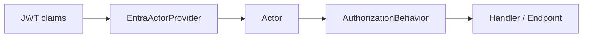

# ASP.NET Core Authorization

**Level:** Intermediate | **Time:** 15-20 min | **Prerequisites:** [Basics](basics.md), [ASP.NET Core Integration](integration-aspnet.md)

Authentication tells you **who** called the API. Trellis authorization needs one more step: turn that authenticated principal into an `Actor` with permissions, forbidden permissions, and attributes that the rest of your application can trust. `Trellis.Asp.Authorization` handles that translation.

This article focuses on Azure Entra ID because `AddEntraActorProvider()` is the most opinionated setup, but the same package also includes generic claims-based and development-only providers.

## The mental model



Why this matters:

- your handlers stop parsing claims directly
- permission checks become uniform
- ABAC data such as tenant ID or MFA state is available from one object

## Quick start with Entra ID

```csharp
using System.Linq;
using Microsoft.AspNetCore.Authorization;
using Microsoft.AspNetCore.Authentication.JwtBearer;
using Trellis.Asp.Authorization;
using Trellis.Authorization;

var builder = WebApplication.CreateBuilder(args);

builder.Services.AddAuthentication().AddJwtBearer();
builder.Services.AddAuthorization();
builder.Services.AddEntraActorProvider();

var app = builder.Build();

app.UseAuthentication();
app.UseAuthorization();

app.MapGet("/me", [Authorize] async (IActorProvider actorProvider, CancellationToken ct) =>
{
    var actor = await actorProvider.GetCurrentActorAsync(ct);

    return Results.Ok(new
    {
        actor.Id,
        Permissions = actor.Permissions.OrderBy(p => p).ToArray(),
        TenantId = actor.GetAttribute(ActorAttributes.TenantId),
        Mfa = actor.GetAttribute(ActorAttributes.MfaAuthenticated)
    });
});

app.Run();
```

That one registration makes `IActorProvider` available in DI, and `EntraActorProvider` builds the `Actor` from the current authenticated user.

> [!NOTE]
> `AddEntraActorProvider()` maps claims to an `Actor`. It does **not** authenticate tokens by itself. You still need your normal authentication middleware.

## Default Entra mapping

Out of the box, `EntraActorProvider` does a useful amount of work for you.

| `Actor` member | Default source | Notes |
| --- | --- | --- |
| `Id` | `IdClaimType`, defaulting to the long object identifier claim | Falls back to short `oid` when `IdClaimType` is left at its default |
| `Permissions` | `roles` and `ClaimTypes.Role` | Stored as a set for fast lookups |
| `ForbiddenPermissions` | empty set | Override with `MapForbiddenPermissions` |
| `Attributes["tid"]` | `tid` | Tenant ID |
| `Attributes["preferred_username"]` | `preferred_username` | Good for display and audit, not authorization |
| `Attributes["azp"]` | `azp` | Authorized party / client app |
| `Attributes["azpacr"]` | `azpacr` | Client authentication method |
| `Attributes["acrs"]` | `acrs` | Authentication context class reference |
| `Attributes["ip_address"]` | `HttpContext.Connection.RemoteIpAddress` | Request IP |
| `Attributes["mfa"]` | derived from `amr` | `"true"` if any `amr` claim equals `"mfa"` ignoring case; otherwise `"false"` |

## Customizing claim mapping

Most teams customize permissions before they customize anything else.

### Flatten Entra roles into app permissions

```csharp
using Trellis.Asp.Authorization;

var builder = WebApplication.CreateBuilder(args);

builder.Services.AddEntraActorProvider(options =>
{
    options.MapPermissions = claims =>
    {
        var rolePermissionMap = new Dictionary<string, string[]>
        {
            ["Catalog.Admin"] = ["Products.Read", "Products.Write", "Products.Delete"],
            ["Catalog.Reader"] = ["Products.Read"]
        };

        return claims
            .Where(c => string.Equals(c.Type, "roles", StringComparison.OrdinalIgnoreCase))
            .SelectMany(c => rolePermissionMap.TryGetValue(c.Value, out var permissions)
                ? permissions
                : Array.Empty<string>())
            .ToHashSet(StringComparer.Ordinal);
    };
});
```

### Use delegated scopes instead of roles

```csharp
builder.Services.AddEntraActorProvider(options =>
{
    options.MapPermissions = claims => claims
        .Where(c => string.Equals(c.Type, "scp", StringComparison.OrdinalIgnoreCase))
        .SelectMany(c => c.Value.Split(' ', StringSplitOptions.RemoveEmptyEntries))
        .ToHashSet(StringComparer.Ordinal);
});
```

### Change the actor ID claim

```csharp
builder.Services.AddEntraActorProvider(options =>
{
    options.IdClaimType = "sub";
});
```

### Add forbidden permissions or custom attributes

```csharp
builder.Services.AddEntraActorProvider(options =>
{
    options.MapForbiddenPermissions = claims => claims
        .Where(c => string.Equals(c.Type, "denied_permissions", StringComparison.OrdinalIgnoreCase))
        .Select(c => c.Value)
        .ToHashSet(StringComparer.Ordinal);

    options.MapAttributes = (claims, httpContext) =>
    {
        var attributes = new Dictionary<string, string>();

        var region = claims.FirstOrDefault(c => c.Type == "region")?.Value;
        if (!string.IsNullOrWhiteSpace(region))
            attributes["region"] = region;

        var ipAddress = httpContext.Connection.RemoteIpAddress?.ToString();
        if (!string.IsNullOrWhiteSpace(ipAddress))
            attributes[ActorAttributes.IpAddress] = ipAddress;

        return attributes;
    };
});
```

> [!WARNING]
> If `MapPermissions`, `MapForbiddenPermissions`, or `MapAttributes` throws, `EntraActorProvider` wraps that exception in an `InvalidOperationException` that points back to the failing option delegate.

## Working with `Actor`

Once you have an `Actor`, authorization logic becomes plain application code.

### Permission checks

```csharp
if (!actor.HasPermission("Products.Delete"))
    return Result.Fail(new Error.Forbidden("policy.id") { Detail = "Products.Delete is required." });
```

### Scoped permissions

`Actor.HasPermission(permission, scope)` uses `Actor.PermissionScopeSeparator`, which is `':'`.

```csharp
var tenantId = actor.GetAttribute(ActorAttributes.TenantId);

if (tenantId is null || !actor.HasPermission("Documents.Read", tenantId))
    return Result.Fail(new Error.Forbidden("policy.id") { Detail = "You cannot read documents in this tenant." });
```

That call checks for a permission string shaped like:

```text
Documents.Read:tenant-123
```

## Using authorization with Trellis.Mediator

This is where the actor-provider abstraction becomes especially useful: authorization runs in the pipeline instead of being repeated in every handler.

### Static permission checks with `IAuthorize`

```csharp
using Mediator;
using Trellis;
using Trellis.Authorization;

public sealed record DeleteDocumentCommand(string DocumentId)
    : ICommand<Result>, IAuthorize
{
    public IReadOnlyList<string> RequiredPermissions => ["Documents.Delete"];
}
```

Register the provider and the Trellis mediator behaviors together:

```csharp
using Mediator;
using Microsoft.AspNetCore.Authentication.JwtBearer;
using Trellis.Asp.Authorization;

var builder = WebApplication.CreateBuilder(args);

builder.Services.AddAuthentication().AddJwtBearer();
builder.Services.AddAuthorization();
builder.Services.AddEntraActorProvider();

builder.Services.AddMediator(options =>
{
    options.ServiceLifetime = ServiceLifetime.Scoped;
    options.PipelineBehaviors = [.. Trellis.Mediator.ServiceCollectionExtensions.PipelineBehaviors];
});
```

### Resource-based checks with `IAuthorizeResource<TResource>`

Use resource-based authorization when the rule depends on the loaded entity, not just the caller’s static permissions.

```csharp
using Mediator;
using Trellis;
using Trellis.Authorization;

public sealed record Document(string Id, string OwnerId);

public sealed record EditDocumentCommand(string DocumentId)
    : ICommand<Result<Document>>, IAuthorizeResource<Document>
{
    public IResult Authorize(Actor actor, Document resource) =>
        actor.IsOwner(resource.OwnerId) || actor.HasPermission("Documents.EditAny")
            ? Result.Ok()
            : Result.Fail(new Error.Forbidden("policy.id") { Detail = "Only the owner can edit this document." });
}
```

`IAuthorizeResource<TResource>` is contravariant (`in TResource`), which makes it easy to express rules against broader resource types when that fits your design.

## `ActorAttributes` constants

Use the built-in constants instead of hand-typed strings:

```csharp
using Trellis.Authorization;

var tenantId = actor.GetAttribute(ActorAttributes.TenantId);
var clientApp = actor.GetAttribute(ActorAttributes.AuthorizedParty);
var mfa = actor.GetAttribute(ActorAttributes.MfaAuthenticated);
```

This helps avoid subtle bugs from casing or spelling mismatches.

## Other actor providers in the same package

### `AddClaimsActorProvider()`

Use this when your identity provider is not Entra or when your tokens already have the exact claims you want.

```csharp
builder.Services.AddClaimsActorProvider(options =>
{
    options.ActorIdClaim = "sub";
    options.PermissionsClaim = "permissions";
});
```

### `AddDevelopmentActorProvider()`

Use this only for local development and tests.

```csharp
builder.Services.AddDevelopmentActorProvider(options =>
{
    options.DefaultActorId = "development";
    options.DefaultPermissions = new HashSet<string> { "Products.Read", "Products.Write" };
});
```

> [!WARNING]
> `DevelopmentActorProvider` throws whenever the host environment is **not** Development. That is true even if the `X-Test-Actor` header is absent.

### `AddCachingActorProvider<T>()`

Use this when resolving the current actor requires extra async work, such as database lookups.

```csharp
using Microsoft.AspNetCore.Http;
using Trellis.Authorization;
using Trellis.Asp.Authorization;

builder.Services.AddCachingActorProvider<DatabaseActorProvider>();

public interface IPermissionStore
{
    Task<IReadOnlySet<string>> GetPermissionsAsync(string userId, CancellationToken cancellationToken);
}

public sealed class DatabaseActorProvider(
    IHttpContextAccessor httpContextAccessor,
    IPermissionStore permissionStore) : IActorProvider
{
    public async Task<Actor> GetCurrentActorAsync(CancellationToken cancellationToken = default)
    {
        var userId = httpContextAccessor.HttpContext?.User.FindFirst("sub")?.Value
            ?? throw new InvalidOperationException("Missing user id.");

        var permissions = await permissionStore.GetPermissionsAsync(userId, cancellationToken);
        return Actor.Create(userId, permissions);
    }
}
```

`CachingActorProvider` caches the first resolution task per request scope, so repeated authorization checks do not repeat the expensive work.

## Best practices

1. **Map coarse claims to fine-grained permissions once.** Keep runtime checks simple and fast.
2. **Use `ActorAttributes` constants.** They are safer than raw strings.
3. **Do not authorize on `preferred_username`.** It is for display and audit, not identity stability.
4. **Use scoped permissions when tenant or resource scope matters.**
5. **Keep development-only actor injection out of non-development environments.**

## Next steps

- Pair this with [ASP.NET Core Integration](integration-aspnet.md) to map failures cleanly to HTTP
- Use [FluentValidation Integration](integration-fluentvalidation.md) if commands also need structured validation
- Use [integration-mediator.md](integration-mediator.md) for deeper pipeline-behavior patterns
