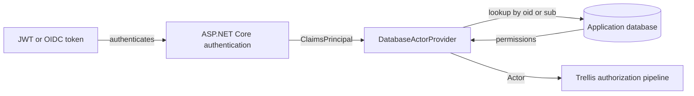
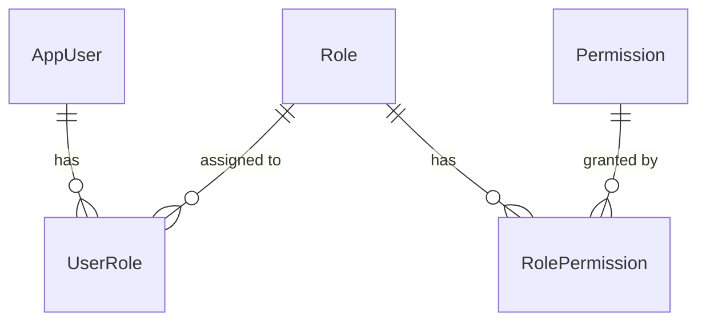

# Database-Backed Permissions

When JWT app roles are too coarse, too static, or too limited, you need authorization data you can manage in your own system. This pattern keeps **authentication** in your identity provider and moves **permissions** into your application database.

The good news: you can do that with the existing `IActorProvider` abstraction. You do not need a special Trellis permissions package.

## Table of Contents

- [When this pattern helps](#when-this-pattern-helps)
- [Architecture](#architecture)
- [A minimal domain model](#a-minimal-domain-model)
- [Loading permissions from EF Core](#loading-permissions-from-ef-core)
- [Turning claims into an `Actor`](#turning-claims-into-an-actor)
- [Dependency injection setup](#dependency-injection-setup)
- [Seeding and testing](#seeding-and-testing)

## When this pattern helps

Choose database-backed permissions when you need authorization rules that change faster than your identity provider configuration.

| Approach | Identity source | Permission source | Best fit |
| --- | --- | --- | --- |
| JWT roles only | token claims | token claims | small, mostly static systems |
| Hybrid | token claims | application database | most business applications |
| Database only | custom auth | application database | non-OIDC or fully custom auth stacks |

The hybrid model is usually the sweet spot:

- the identity provider proves **who** the user is
- your database decides **what** the user can do
- admins can change permissions without redeploying auth config

## Architecture



In other words:

- authentication stays outside your app
- authorization becomes application data

## A minimal domain model

Start simple. You only need users, roles, permissions, and two many-to-many relationships.



```csharp
namespace MyService.Domain;

public sealed class AppUser
{
    public Guid Id { get; set; }
    public string ExternalId { get; set; } = string.Empty;
    public string DisplayName { get; set; } = string.Empty;
    public ICollection<Role> Roles { get; } = [];
}

public sealed class Role
{
    public Guid Id { get; set; }
    public string Name { get; set; } = string.Empty;
    public string Description { get; set; } = string.Empty;
    public ICollection<AppUser> Users { get; } = [];
    public ICollection<Permission> Permissions { get; } = [];
}

public sealed class Permission
{
    public Guid Id { get; set; }
    public string Name { get; set; } = string.Empty;
    public string Description { get; set; } = string.Empty;
    public ICollection<Role> Roles { get; } = [];
}

public static class Permissions
{
    public const string OrdersCreate = "orders:create";
    public const string OrdersApprove = "orders:approve";
    public const string OrdersRead = "orders:read";
    public const string OrdersReadAll = "orders:read-all";
}
```

> [!TIP]
> If your domain already uses Trellis value objects for IDs or names, keep using them. The authorization pattern here does not depend on primitive-only entities.

## Loading permissions from EF Core

The repository has one job: translate an authenticated external identity into a flat permission set.

```csharp
using Microsoft.EntityFrameworkCore;

namespace MyService.Application;

public interface IPermissionRepository
{
    Task<IReadOnlySet<string>> GetPermissionsForUserAsync(
        string externalUserId,
        CancellationToken cancellationToken);
}

public sealed class PermissionRepository(AppDbContext db) : IPermissionRepository
{
    public async Task<IReadOnlySet<string>> GetPermissionsForUserAsync(
        string externalUserId,
        CancellationToken cancellationToken)
    {
        var permissions = await db.Users
            .Where(user => user.ExternalId == externalUserId)
            .SelectMany(user => user.Roles)
            .SelectMany(role => role.Permissions)
            .Select(permission => permission.Name)
            .Distinct()
            .ToListAsync(cancellationToken)
            .ConfigureAwait(false);

        return permissions.ToHashSet(StringComparer.Ordinal);
    }
}
```

A minimal EF Core mapping is enough:

```csharp
using Microsoft.EntityFrameworkCore;

namespace MyService.Infrastructure;

public sealed class AppDbContext(DbContextOptions<AppDbContext> options) : DbContext(options)
{
    public DbSet<AppUser> Users => Set<AppUser>();
    public DbSet<Role> Roles => Set<Role>();
    public DbSet<Permission> Permissions => Set<Permission>();

    protected override void OnModelCreating(ModelBuilder modelBuilder)
    {
        modelBuilder.Entity<AppUser>(builder =>
        {
            builder.HasKey(x => x.Id);
            builder.HasIndex(x => x.ExternalId).IsUnique();
            builder.HasMany(x => x.Roles)
                .WithMany(x => x.Users)
                .UsingEntity("UserRoles");
        });

        modelBuilder.Entity<Role>(builder =>
        {
            builder.HasKey(x => x.Id);
            builder.HasIndex(x => x.Name).IsUnique();
            builder.HasMany(x => x.Permissions)
                .WithMany(x => x.Roles)
                .UsingEntity("RolePermissions");
        });

        modelBuilder.Entity<Permission>(builder =>
        {
            builder.HasKey(x => x.Id);
            builder.HasIndex(x => x.Name).IsUnique();
        });
    }
}
```

## Turning claims into an `Actor`

This is the core integration point. The provider reads the authenticated user ID from claims, loads permissions from the database, and returns an `Actor`.

```csharp
using System.Security.Claims;
using Microsoft.AspNetCore.Http;
using Trellis.Authorization;

namespace MyService.Api;

public sealed class DatabaseActorProvider(
    IHttpContextAccessor httpContextAccessor,
    IPermissionRepository permissionRepository) : IActorProvider
{
    public async Task<Actor> GetCurrentActorAsync(CancellationToken cancellationToken = default)
    {
        var httpContext = httpContextAccessor.HttpContext
            ?? throw new InvalidOperationException("No HttpContext is available.");

        var principal = httpContext.User;
        if (principal.Identity?.IsAuthenticated != true)
            throw new InvalidOperationException("The current request is not authenticated.");

        var externalId = principal.FindFirstValue("oid")
            ?? principal.FindFirstValue("sub")
            ?? throw new InvalidOperationException("No 'oid' or 'sub' claim was found.");

        var permissions = await permissionRepository
            .GetPermissionsForUserAsync(externalId, cancellationToken)
            .ConfigureAwait(false);

        return Actor.Create(externalId, permissions);
    }
}
```

Why this works well:

- `IActorProvider` is already asynchronous
- `Actor.Create(string id, IReadOnlySet<string> permissions)` matches the repository result shape
- the rest of Trellis authorization continues to work exactly the same way

## Dependency injection setup

Use your normal JWT/OIDC authentication, then wrap your DB-backed provider with `AddCachingActorProvider<T>()`.

```csharp
using Microsoft.AspNetCore.Authentication.JwtBearer;
using Trellis.Asp.Authorization;

if (environment.IsDevelopment())
{
    services.AddDevelopmentActorProvider();
}
else
{
    services.AddAuthentication(JwtBearerDefaults.AuthenticationScheme)
        .AddJwtBearer(options => configuration.Bind("AzureAd", options));

    services.AddScoped<IPermissionRepository, PermissionRepository>();
    services.AddCachingActorProvider<DatabaseActorProvider>();
}
```

> [!NOTE]
> `AddCachingActorProvider<T>()` gives you **request-scoped caching**, not a shared app-wide cache. Multiple resolutions during one HTTP request reuse the same in-flight actor lookup. A later request performs a fresh lookup.

That usually means:

- no extra invalidation logic is required
- permission changes take effect on the next request
- expensive duplicate lookups inside one request are avoided

## Seeding and testing

### Seed roles and permissions

You can seed data at startup, in a migration, or through an admin workflow. The important part is that permission names stay stable.

```csharp
using Microsoft.EntityFrameworkCore;

public static class PermissionSeeder
{
    public static async Task SeedAsync(AppDbContext db, CancellationToken cancellationToken = default)
    {
        if (await db.Roles.AnyAsync(cancellationToken))
            return;

        var create = new Permission
        {
            Id = Guid.NewGuid(),
            Name = Permissions.OrdersCreate,
            Description = "Create orders"
        };

        var read = new Permission
        {
            Id = Guid.NewGuid(),
            Name = Permissions.OrdersRead,
            Description = "Read orders"
        };

        var salesRep = new Role
        {
            Id = Guid.NewGuid(),
            Name = "SalesRep",
            Description = "Can create and read orders"
        };

        salesRep.Permissions.Add(create);
        salesRep.Permissions.Add(read);

        db.Permissions.AddRange(create, read);
        db.Roles.Add(salesRep);

        await db.SaveChangesAsync(cancellationToken);
    }
}
```

### Testing story

One of the nice parts of this pattern is that your test strategy barely changes:

- **unit/application tests** can still use `TestActorProvider`
- **API tests** can still use `DevelopmentActorProvider` and `CreateClientWithActor(...)`
- **end-to-end tests** can use real tokens plus seeded permission data

> [!TIP]
> Keep the permission names in one shared `Permissions` class. It reduces drift between authorization policies, test setup, seed data, and admin UI code.
