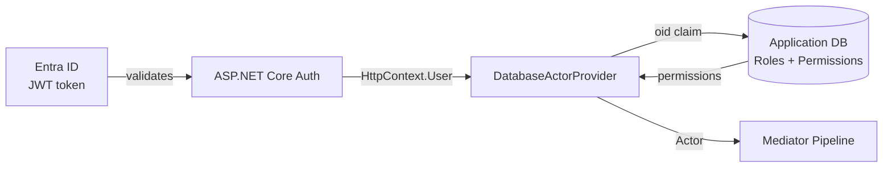
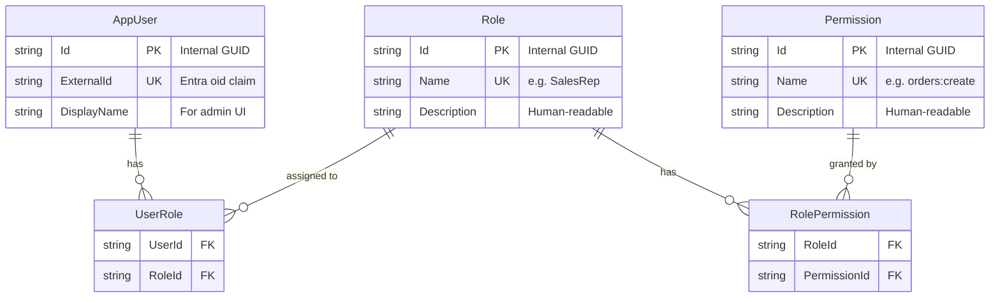

# Database-Backed Permissions

This guide shows how to store roles and permissions in your application database instead of (or in addition to) Azure Entra ID app roles. Uses the existing `IAsyncActorProvider` interface — no additional Trellis packages required.

## When to Use

| Approach | Identity From | Permissions From | Best For |
|----------|--------------|-----------------|----------|
| **AAD app roles only** | JWT `oid` | JWT `roles` | Simple apps, few static permissions |
| **Hybrid (recommended)** | JWT `oid` (Entra) | Database | Granular permissions, admin UI, runtime role management |
| **DB-only** | Custom auth | Database | Non-Entra identity providers |

Choose the hybrid approach when you need:

- More permissions than AAD app roles support (≈250 limit per app)
- An admin UI to assign roles/permissions at runtime
- Different permission sets per tenant in a multi-tenant application
- Audit trails for permission changes

## Architecture



Entra handles **authentication** (who are you?). The database handles **authorization** (what can you do?).

## Database Schema



## Domain Layer

### Value Objects

```csharp
namespace MyService.Domain;

using Trellis;

public sealed class ExternalUserId : RequiredString<ExternalUserId>;
public sealed class RoleName : RequiredString<RoleName>;
public sealed class PermissionName : RequiredString<PermissionName>;
```

### Entities

```csharp
namespace MyService.Domain;

public class AppUser
{
    public AppUserId Id { get; set; } = null!;
    public ExternalUserId ExternalId { get; set; } = null!;
    public string DisplayName { get; set; } = string.Empty;

    public ICollection<Role> Roles { get; set; } = [];
}

public class Role
{
    public RoleId Id { get; set; } = null!;
    public RoleName Name { get; set; } = null!;
    public string Description { get; set; } = string.Empty;

    public ICollection<Permission> Permissions { get; set; } = [];
    public ICollection<AppUser> Users { get; set; } = [];
}

public class Permission
{
    public PermissionId Id { get; set; } = null!;
    public PermissionName Name { get; set; } = null!;
    public string Description { get; set; } = string.Empty;

    public ICollection<Role> Roles { get; set; } = [];
}
```

### Permission Constants

Keep the same pattern as AAD-based permissions — a static class with constants:

```csharp
namespace MyService.Domain;

public static class Permissions
{
    public const string CustomersCreate = "customers:create";
    public const string ProductsCreate = "products:create";
    public const string ProductsManageStock = "products:manage-stock";
    public const string OrdersCreate = "orders:create";
    public const string OrdersSubmit = "orders:submit";
    public const string OrdersApprove = "orders:approve";
    public const string OrdersShip = "orders:ship";
    public const string OrdersDeliver = "orders:deliver";
    public const string OrdersCancel = "orders:cancel";
    public const string OrdersRead = "orders:read";
    public const string OrdersReadAll = "orders:read-all";
}
```

## Application Layer

### Repository Interface

```csharp
namespace MyService.Application.Abstractions;

public interface IPermissionRepository
{
    Task<IReadOnlySet<string>> GetPermissionsForUserAsync(
        string externalUserId,
        CancellationToken ct);
}
```

## Anti-Corruption Layer (EF Core)

### Entity Configuration

```csharp
namespace MyService.AntiCorruptionLayer;

using Microsoft.EntityFrameworkCore;
using Microsoft.EntityFrameworkCore.Metadata.Builders;

public class AppUserConfiguration : IEntityTypeConfiguration<AppUser>
{
    public void Configure(EntityTypeBuilder<AppUser> builder)
    {
        builder.HasKey(u => u.Id);
        builder.HasIndex(u => u.ExternalId).IsUnique();
        builder.HasMany(u => u.Roles)
            .WithMany(r => r.Users)
            .UsingEntity("UserRoles");
    }
}

public class RoleConfiguration : IEntityTypeConfiguration<Role>
{
    public void Configure(EntityTypeBuilder<Role> builder)
    {
        builder.HasKey(r => r.Id);
        builder.HasIndex(r => r.Name).IsUnique();
        builder.HasMany(r => r.Permissions)
            .WithMany(p => p.Roles)
            .UsingEntity("RolePermissions");
    }
}

public class PermissionConfiguration : IEntityTypeConfiguration<Permission>
{
    public void Configure(EntityTypeBuilder<Permission> builder)
    {
        builder.HasKey(p => p.Id);
        builder.HasIndex(p => p.Name).IsUnique();
    }
}
```

### Repository Implementation

```csharp
namespace MyService.AntiCorruptionLayer;

using Microsoft.EntityFrameworkCore;

public class PermissionRepository(AppDbContext context) : IPermissionRepository
{
    public async Task<IReadOnlySet<string>> GetPermissionsForUserAsync(
        string externalUserId,
        CancellationToken ct)
    {
        var permissions = await context.Users
            .Where(u => u.ExternalId.Value == externalUserId)
            .SelectMany(u => u.Roles)
            .SelectMany(r => r.Permissions)
            .Select(p => p.Name.Value)
            .Distinct()
            .ToListAsync(ct)
            .ConfigureAwait(false);

        return permissions.ToHashSet();
    }
}
```

## API Layer — DatabaseActorProvider

```csharp
namespace MyService.Api;

using Microsoft.AspNetCore.Http;
using Microsoft.Extensions.Caching.Memory;
using Trellis.Authorization;

public class DatabaseActorProvider(
    IHttpContextAccessor httpContextAccessor,
    IPermissionRepository permissionRepository,
    IMemoryCache cache) : IAsyncActorProvider
{
    private static readonly TimeSpan CacheDuration = TimeSpan.FromMinutes(5);

    public async Task<Actor> GetCurrentActorAsync(CancellationToken ct = default)
    {
        var httpContext = httpContextAccessor.HttpContext
            ?? throw new InvalidOperationException("No HttpContext available.");

        var user = httpContext.User;
        if (user.Identity?.IsAuthenticated != true)
            throw new InvalidOperationException("No authenticated user.");

        var externalId = user.FindFirstValue("oid")
            ?? user.FindFirstValue("sub")
            ?? throw new InvalidOperationException("No 'oid' or 'sub' claim found.");

        var permissions = await cache.GetOrCreateAsync(
            $"permissions:{externalId}",
            async entry =>
            {
                entry.AbsoluteExpirationRelativeToNow = CacheDuration;
                return await permissionRepository
                    .GetPermissionsForUserAsync(externalId, ct)
                    .ConfigureAwait(false);
            }).ConfigureAwait(false);

        return Actor.Create(externalId, permissions ?? new HashSet<string>());
    }
}
```

### Key Design Decisions

| Decision | Choice | Why |
|----------|--------|-----|
| Provider type | `IAsyncActorProvider` | DB lookup is async; Mediator pipeline prefers async over sync |
| Caching | `IMemoryCache` with 5-min TTL | Permissions change infrequently; avoids DB hit per request |
| User ID source | `oid` claim (fallback `sub`) | Matches Entra ID token format |
| Cache key | `permissions:{externalId}` | Per-user isolation |

## DI Registration

```csharp
// Api/src/DependencyInjection.cs
using Trellis.Asp.Authorization;

if (environment.IsDevelopment())
{
    services.AddDevelopmentActorProvider();
}
else
{
    // Entra handles authentication
    services.AddAuthentication(JwtBearerDefaults.AuthenticationScheme)
        .AddJwtBearer(options => configuration.Bind("AzureAd", options));

    // Database handles authorization
    services.AddMemoryCache();
    services.AddScoped<IPermissionRepository, PermissionRepository>();
    services.AddScoped<IAsyncActorProvider, DatabaseActorProvider>();
}
```

> **Note:** Do NOT register `IActorProvider` (sync) when using `DatabaseActorProvider`. The Mediator `AuthorizationBehavior` prefers `IAsyncActorProvider` when registered — no `EntraActorProvider` needed for the permissions path.

## Seed Data

Seed roles and permissions on application startup or via migrations:

```csharp
// In Program.cs or a hosted service
if (app.Environment.IsDevelopment())
{
    using var scope = app.Services.CreateScope();
    var context = scope.ServiceProvider.GetRequiredService<AppDbContext>();
    context.Database.EnsureCreated();
    await SeedPermissions.SeedAsync(context);
}
```

```csharp
public static class SeedPermissions
{
    public static async Task SeedAsync(AppDbContext context)
    {
        if (await context.Roles.AnyAsync())
            return; // Already seeded

        // Create permissions
        var allPermissions = new[]
        {
            Permissions.CustomersCreate,
            Permissions.ProductsCreate,
            Permissions.ProductsManageStock,
            Permissions.OrdersCreate,
            Permissions.OrdersSubmit,
            Permissions.OrdersApprove,
            Permissions.OrdersShip,
            Permissions.OrdersDeliver,
            Permissions.OrdersCancel,
            Permissions.OrdersRead,
            Permissions.OrdersReadAll,
        };

        var permissionEntities = allPermissions.Select(p => new Permission
        {
            Id = PermissionId.NewUniqueV7(),
            Name = PermissionName.Create(p),
            Description = p
        }).ToList();

        context.Permissions.AddRange(permissionEntities);

        // Create roles with permission assignments
        Permission Find(string name) => permissionEntities.First(p => p.Name.Value == name);

        var salesRep = new Role
        {
            Id = RoleId.NewUniqueV7(),
            Name = RoleName.Create("SalesRep"),
            Description = "Can create customers and manage their own orders",
            Permissions =
            {
                Find(Permissions.CustomersCreate),
                Find(Permissions.OrdersCreate),
                Find(Permissions.OrdersSubmit),
                Find(Permissions.OrdersCancel),
                Find(Permissions.OrdersRead),
            }
        };

        var warehouseManager = new Role
        {
            Id = RoleId.NewUniqueV7(),
            Name = RoleName.Create("WarehouseManager"),
            Description = "Manages products and fulfills orders",
            Permissions =
            {
                Find(Permissions.ProductsCreate),
                Find(Permissions.ProductsManageStock),
                Find(Permissions.OrdersApprove),
                Find(Permissions.OrdersShip),
                Find(Permissions.OrdersDeliver),
                Find(Permissions.OrdersReadAll),
            }
        };

        var admin = new Role
        {
            Id = RoleId.NewUniqueV7(),
            Name = RoleName.Create("Admin"),
            Description = "Full access to all operations",
            Permissions = permissionEntities.ToList()
        };

        context.Roles.AddRange(salesRep, warehouseManager, admin);
        await context.SaveChangesAsync();
    }
}
```

## Testing

### Unit/Application Tests — Unchanged

`TestActorProvider` works the same way — permissions are provided directly:

```csharp
var actorProvider = new TestActorProvider("user-1", Permissions.OrdersCreate, Permissions.OrdersRead);
```

### API Integration Tests — Unchanged

`CreateClientWithActor` works the same way — the `DevelopmentActorProvider` reads the `X-Test-Actor` header:

```csharp
var client = factory.CreateClientWithActor("user-1", Permissions.OrdersCreate, Permissions.OrdersRead);
```

### E2E Tests with Real Tokens

With DB-backed permissions, real JWT tokens from Entra authenticate the user, then `DatabaseActorProvider` loads permissions from the test database:

```csharp
// Seed a test user with SalesRep role
await SeedTestUser(context, "salesrep-oid-123", "SalesRep");

// Acquire a real token for the corresponding Entra test user
var client = await factory.CreateClientWithEntraTokenAsync(tokenProvider, "salesRep");

// The request is authenticated via JWT, permissions loaded from DB
var response = await client.PostAsync("/api/orders", content);
response.StatusCode.Should().Be(HttpStatusCode.OK);
```

## Cache Invalidation

When roles or permissions change at runtime (e.g., via an admin API), invalidate the cache:

```csharp
public class PermissionCacheInvalidator(IMemoryCache cache)
{
    public void InvalidateUser(string externalUserId) =>
        cache.Remove($"permissions:{externalUserId}");

    public void InvalidateAll()
    {
        // IMemoryCache doesn't support clear-all natively.
        // Options: use CancellationTokenSource, or switch to IDistributedCache.
        // For single-instance apps, replace the cache instance.
    }
}
```

For multi-instance deployments, consider `IDistributedCache` (Redis) instead of `IMemoryCache`.
