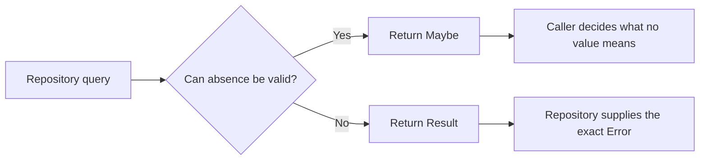

# Entity Framework Core Integration

**Level:** Intermediate 📚 | **Time:** 30-40 min | **Prerequisites:** [Basics](basics.md)

Entity Framework Core is usually where clean domain code starts to feel messy: value objects need converters, queries return `null`, and database exceptions leak into application code. `Trellis.EntityFrameworkCore` exists to keep that plumbing predictable.

This guide starts with the smallest useful setup, then builds up to query patterns, save patterns, and the conventions Trellis adds for you.

## Table of Contents

- [Quick start](#quick-start)
- [Querying without null checks everywhere](#querying-without-null-checks-everywhere)
- [Saving without exception-driven flow](#saving-without-exception-driven-flow)
- [What `ApplyTrellisConventions` actually does](#what-applytrellisconventions-actually-does)
- [Optimistic concurrency with ETags](#optimistic-concurrency-with-etags)
- [When to use `Maybe<T>` vs `Result<T>`](#when-to-use-maybet-vs-resultt)
- [Manual EF Core setup without the package](#manual-ef-core-setup-without-the-package)

## Quick start

If you want Trellis value objects, Trellis-friendly query helpers, and save helpers that return `Result<T>`, this is the minimum setup:

```bash
dotnet add package Trellis.EntityFrameworkCore
```

```csharp
using Microsoft.EntityFrameworkCore;
using Trellis;
using Trellis.EntityFrameworkCore;
using Trellis.Primitives;

namespace MyApp.Data;

public sealed class CustomerId : RequiredGuid<CustomerId>;
public sealed class CustomerName : RequiredString<CustomerName>;

public sealed class Customer : Aggregate<CustomerId>
{
    public CustomerName Name { get; private set; } = null!;
    public EmailAddress Email { get; private set; } = null!;

    private Customer()
        : base(CustomerId.NewUniqueV7())
    {
    }

    public static Result<Customer> Create(CustomerName name, EmailAddress email) =>
        Result.Success(new Customer
        {
            Name = name,
            Email = email
        });
}

public sealed class AppDbContext(DbContextOptions<AppDbContext> options) : DbContext(options)
{
    public DbSet<Customer> Customers => Set<Customer>();

    protected override void ConfigureConventions(ModelConfigurationBuilder configurationBuilder) =>
        configurationBuilder.ApplyTrellisConventions(typeof(CustomerId).Assembly);

    protected override void OnModelCreating(ModelBuilder modelBuilder)
    {
        modelBuilder.Entity<Customer>(builder =>
        {
            builder.HasKey(x => x.Id);
            builder.Property(x => x.Name).HasMaxLength(100);
            builder.Property(x => x.Email).HasMaxLength(254);
        });
    }
}
```

Register EF Core and Trellis interceptors in DI:

```csharp
using Microsoft.EntityFrameworkCore;
using Trellis.EntityFrameworkCore;

services.AddDbContext<AppDbContext>(options =>
    options.UseSqlServer(connectionString)
        .AddTrellisInterceptors());
```

> [!TIP]
> `ApplyTrellisConventions(...)` is the main entry point for model configuration. `AddTrellisInterceptors()` is the main entry point for runtime save behavior. You usually want both.

## Querying without null checks everywhere

The main problem in repository code is not querying itself. It is answering the question, “What does absence mean here?”

- Use `Maybe<T>` when “not found” is normal and the caller should decide what it means.
- Use `Result<T>` when “not found” is already an error at the repository boundary.

```csharp
using Microsoft.EntityFrameworkCore;
using Trellis;
using Trellis.EntityFrameworkCore;
using Trellis.Primitives;

namespace MyApp.Data;

public sealed class CustomerRepository(AppDbContext db)
{
    public Task<Maybe<Customer>> GetByEmailAsync(EmailAddress email, CancellationToken ct) =>
        db.Customers.FirstOrDefaultMaybeAsync(x => x.Email == email, ct);

    public Task<Result<Customer>> GetRequiredAsync(CustomerId id, CancellationToken ct) =>
        db.Customers.FirstOrDefaultResultAsync(
            x => x.Id == id,
            Error.NotFound($"Customer {id} was not found."),
            ct);
}
```

> [!IMPORTANT]
> `FirstOrDefaultResultAsync(...)` returns **the exact `Error` you pass in**. It does not automatically create a `NotFoundError`.

### Query flow at a glance



## Saving without exception-driven flow

The next pain point is `SaveChangesAsync()`: it succeeds with a row count, but failures come back as exceptions. Trellis wraps that pattern so your repository can stay on the railway.

Use:

- `SaveChangesResultAsync(...)` when you care about the row count
- `SaveChangesResultUnitAsync(...)` when success/failure is enough

```csharp
using Microsoft.EntityFrameworkCore;
using Trellis;
using Trellis.EntityFrameworkCore;

namespace MyApp.Data;

public sealed class CustomerRepository(AppDbContext db)
{
    public async Task<Result<Unit>> AddAsync(Customer customer, CancellationToken ct)
    {
        db.Customers.Add(customer);
        return await db.SaveChangesResultUnitAsync(ct);
    }

    public async Task<Result<int>> SaveAsync(CancellationToken ct) =>
        await db.SaveChangesResultAsync(ct);
}
```

### How save failures are mapped

| EF Core failure | Trellis result |
| --- | --- |
| `DbUpdateConcurrencyException` | `ConflictError` (`conflict.error`) |
| Duplicate key `DbUpdateException` | `ConflictError` (`conflict.error`) |
| Foreign key `DbUpdateException` | `DomainError` (`domain.error`) |

> [!NOTE]
> The Trellis save helpers call EF Core’s `SaveChangesAsync(...)` internally. The public API you should use is `SaveChangesResultAsync(...)` or `SaveChangesResultUnitAsync(...)`.

### Preferred approach: RepositoryBase + IUnitOfWork

For CQRS applications using the Trellis Mediator pipeline, use `RepositoryBase<TAggregate, TId>` with `IUnitOfWork` instead of calling `SaveChangesResultAsync` directly. Repositories stage changes; the `TransactionalCommandBehavior` pipeline behavior auto-commits after successful command handlers.

```csharp
// Repository — staging only, never calls SaveChanges
public class OrderRepository(AppDbContext db) : RepositoryBase<Order, OrderId>(db)
{
    protected override IQueryable<Order> BuildFindByIdQuery() =>
        DbSet.Include(o => o.LineItems);
}

// Command handler — pure domain logic, no persistence concerns
public async ValueTask<Result<Order>> Handle(ShipOrderCommand cmd, CancellationToken ct)
{
    var maybe = await _orders.FindByIdAsync(cmd.OrderId, ct);
    return maybe
        .ToResult(Error.NotFound("Order not found."))
        .Bind(order => order.Ship());
    // TransactionalCommandBehavior auto-commits the tracked changes on success.
}

// DI registration — call AddTrellisUnitOfWork after AddTrellisBehaviors
// so the commit behavior runs innermost (closest to the handler).
services.AddTrellisBehaviors();
services.AddTrellisUnitOfWork<AppDbContext>();
```

## What `ApplyTrellisConventions` actually does

Most teams adopt the package for one reason: they do not want to hand-write `HasConversion(...)` for every value object. That is the first benefit, but not the only one.

When you call `ApplyTrellisConventions(...)`, Trellis:

- scans the assemblies you pass in for Trellis value object types
- always includes built-in Trellis primitives for scalar value objects
- registers scalar converters up front so EF Core treats those types as scalar properties
- applies `Maybe<T>` conventions
- applies composite value object conventions
- applies `Money` conventions
- marks aggregate `ETag` as a concurrency token
- ignores transient aggregate properties such as `IsChanged`

### A subtle but important detail about composite value objects

Composite value objects are not treated like scalar converters. They follow **owned-type conventions**.

That matters because:

- a composite value object becomes structured EF Core mapping, not a single scalar column
- `Maybe<T>` around an owned composite can stay inline **only when EF Core can model it safely**
- when a `Maybe<T>` owned value has nested owned types or non-nullable value-type members, Trellis moves it to a separate owned table instead of generating invalid nullable inline mapping

> [!WARNING]
> `ApplyTrellisConventions(...)` only discovers composite value objects in the assemblies you explicitly pass in. If a composite type lives in another assembly, include that assembly too.

## Maybe property convention

`Maybe<T>` solves a domain problem—optional values—while EF Core still needs a storage strategy.

Trellis handles two common cases for you:

- `Maybe<T>` over a scalar value object maps through scalar conversion rules
- `Maybe<T>` over an owned composite value object follows owned-type rules

For owned composites, Trellis prefers inline nullable columns when EF Core can represent them safely. If the owned value contains nested owned types or non-nullable value-type members, Trellis switches to a separate owned table instead.

That keeps your domain model expressive without forcing you to hand-author the tricky nullability mapping yourself.

## Optimistic concurrency with ETags

Concurrency bugs are hard to reason about after the fact. Trellis gives aggregates an `ETag` story that works with EF Core instead of around it.

You do **not** configure internal convention or interceptor types directly. The supported public API is:

- `ApplyTrellisConventions(...)`
- `AddTrellisInterceptors()`

Once those are registered:

- aggregate `ETag` is configured as a concurrency token
- a new ETag is generated when an aggregate is **Added**
- a new ETag is generated when an aggregate is **Modified**
- aggregate roots can also be promoted when loaded dependents changed, so concurrency still works at the aggregate boundary

```csharp
using Trellis;
using Trellis.EntityFrameworkCore;
using Trellis.Primitives;

namespace MyApp.Data;

public sealed class OrderId : RequiredGuid<OrderId>;

public sealed class Order : Aggregate<OrderId>
{
    public string Description { get; private set; } = string.Empty;

    private Order()
        : base(OrderId.NewUniqueV7())
    {
    }

    public static Order Create(string description) =>
        new()
        {
            Description = description
        };

    public void Rename(string description) => Description = description;
}
```

```csharp
public sealed class OrderRepository(AppDbContext db)
{
    public async Task<Result<Unit>> UpdateAsync(Order order, CancellationToken ct)
    {
        db.Orders.Update(order);
        return await db.SaveChangesResultUnitAsync(ct);
    }
}
```

If another writer changed the same aggregate first, EF Core throws `DbUpdateConcurrencyException` and Trellis converts that to `ConflictError` with the standard `conflict.error` code.

## When to use `Maybe<T>` vs `Result<T>`

This is the repository design rule that keeps your application layer clear.

| Return type | Use it when | Example |
| --- | --- | --- |
| `Maybe<T>` | absence is data, not failure | “Find customer by email” |
| `Result<T>` | the repository should decide the failure | “Load required customer” |
| `Result<Unit>` | command succeeded or failed | save, delete, update |
| `bool` | you only need existence | uniqueness checks |

### Practical rule of thumb

- Query by optional business key? Start with `Maybe<T>`.
- Load a required resource for a command handler? Use `Result<T>`.
- Persist changes? Use `SaveChangesResultUnitAsync(...)`.

## Manual EF Core setup without the package

Some teams prefer to keep EF Core mapping explicit. That is fine—you just take on the wiring yourself.

```csharp
using Microsoft.EntityFrameworkCore;
using Trellis.Primitives;

protected override void OnModelCreating(ModelBuilder modelBuilder)
{
    modelBuilder.Entity<Customer>(builder =>
    {
        builder.HasKey(x => x.Id);

        builder.Property(x => x.Id)
            .HasConversion(id => id.Value, value => CustomerId.Create(value));

        builder.Property(x => x.Name)
            .HasConversion(name => name.Value, value => CustomerName.Create(value))
            .HasMaxLength(100);

        builder.Property(x => x.Email)
            .HasConversion(email => email.Value, value => EmailAddress.Create(value))
            .HasMaxLength(254);
    });
}
```

That approach works, but you now own:

- converter registration for every scalar value object property
- structured mapping for composite value objects
- nullable/owned rules for `Maybe<T>`
- concurrency token wiring for aggregate ETags
- exception-to-result translation on save

> [!TIP]
> If your model uses more than a handful of Trellis types, the package usually pays for itself very quickly.
