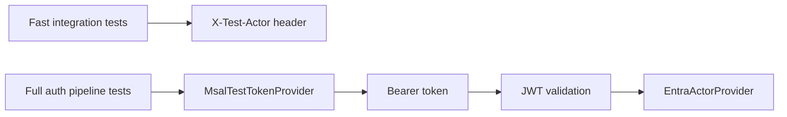

# Testing with Azure Entra ID Tokens

**Level:** Advanced 📙 | **Time:** 20-30 min | **Prerequisites:** [Testing](integration-testing.md), [ASP.NET Core Authorization](integration-asp-authorization.md)

Most Trellis integration tests should use `CreateClientWithActor(...)`. It is fast and perfect when you only want to test authorization behavior inside your app.

But sometimes that is not enough.

If you need to verify the **real authentication path**—token issuance, JWT validation, claim mapping, and `EntraActorProvider`—you need real Entra tokens. That is what `MsalTestTokenProvider` is for.

## When should you use this?

Use real Entra tokens when you want confidence in:

- Azure Entra ID issuing the token you expect
- ASP.NET Core JWT validation
- your claim-to-permission mapping
- `EntraActorProvider` behavior in production-like conditions

Use `CreateClientWithActor(...)` when you only need to test:

- application authorization rules
- handler behavior
- endpoint behavior



## Install the package

```bash
dotnet add package Trellis.Testing
```

## How it works

`MsalTestTokenProvider` uses the MSAL ROPC flow against a dedicated test tenant:

- one Entra test tenant
- one public client app registration
- test users with known passwords
- MFA disabled for those test users

> [!WARNING]
> ROPC is acceptable for automated test tenants. It is not a production authentication pattern.

## Tenant setup checklist

### 1. Create a dedicated test tenant

Never reuse a production tenant for automated tests.

### 2. Register a public client app

In the app registration:

- supported account type: single tenant
- allow public client flows: **Yes**

### 3. Assign app roles to test users

Create users that match the permission profiles you want to test, then assign roles through the Enterprise Application.

### 4. Disable MFA for those test users

ROPC does not support interactive MFA.

## Store configuration safely

Local development should use `dotnet user-secrets`. CI should use environment variables.

### Local secrets

```bash
dotnet user-secrets set "EntraTest:TenantId" "<tenant-id>"
dotnet user-secrets set "EntraTest:ClientId" "<client-id>"
dotnet user-secrets set "EntraTest:Scopes:0" "api://<client-id>/.default"

dotnet user-secrets set "EntraTest:TestUsers:salesRep:Username" "salesrep@contoso-test.onmicrosoft.com"
dotnet user-secrets set "EntraTest:TestUsers:salesRep:Password" "<password>"
dotnet user-secrets set "EntraTest:TestUsers:admin:Username" "admin@contoso-test.onmicrosoft.com"
dotnet user-secrets set "EntraTest:TestUsers:admin:Password" "<password>"
```

### CI environment variables

Configuration binding uses the `EntraTest__` prefix and double underscores for nesting.

```yaml
env:
  EntraTest__TenantId: ${{ secrets.ENTRA_TEST_TENANT_ID }}
  EntraTest__ClientId: ${{ secrets.ENTRA_TEST_CLIENT_ID }}
  EntraTest__Scopes__0: api://${{ secrets.ENTRA_TEST_CLIENT_ID }}/.default
  EntraTest__TestUsers__salesRep__Username: ${{ secrets.ENTRA_TEST_SALESREP_USERNAME }}
  EntraTest__TestUsers__salesRep__Password: ${{ secrets.ENTRA_TEST_SALESREP_PASSWORD }}
```

## Bind configuration into `MsalTestOptions`

`MsalTestTokenProvider` takes `MsalTestOptions`, so keep the test setup boring and explicit.

```csharp
using Microsoft.Extensions.Configuration;
using Trellis.Testing.AspNetCore;

var configuration = new ConfigurationBuilder()
    .AddUserSecrets<Program>(optional: true)
    .AddEnvironmentVariables()
    .Build();

var options = new MsalTestOptions();
configuration.GetSection("EntraTest").Bind(options);

var tokenProvider = new MsalTestTokenProvider(options);
```

> [!TIP]
> Keep one `MsalTestTokenProvider` instance per fixture or test class. MSAL caches tokens per provider instance.

## First working test

The simplest happy path is: create the token provider once, create a client for a named test user, then call the real API.

```csharp
using System.Net;
using System.Net.Http.Json;
using System.Text.Json.Serialization;
using FluentAssertions;
using Microsoft.AspNetCore.Mvc.Testing;
using Microsoft.Extensions.Configuration;
using Trellis.Testing.AspNetCore;
using Xunit;

[JsonSerializable(typeof(CreateOrderRequest))]
internal partial class ApiJsonContext : JsonSerializerContext
{
}

public sealed class Program
{
}

public sealed record CreateOrderRequest(string CustomerId, int Quantity);

public sealed class EntraTestFixture
{
    public EntraTestFixture(WebApplicationFactory<Program> factory)
    {
        Factory = factory;

        var configuration = new ConfigurationBuilder()
            .AddUserSecrets<EntraTestFixture>(optional: true)
            .AddEnvironmentVariables()
            .Build();

        var options = new MsalTestOptions();
        configuration.GetSection("EntraTest").Bind(options);

        if (string.IsNullOrWhiteSpace(options.TenantId) ||
            string.IsNullOrWhiteSpace(options.ClientId))
        {
            throw new InvalidOperationException("Configure EntraTest before running Entra token tests.");
        }

        TokenProvider = new MsalTestTokenProvider(options);
    }

    public WebApplicationFactory<Program> Factory { get; }

    public MsalTestTokenProvider TokenProvider { get; }
}

public sealed class OrdersEntraTests : IClassFixture<WebApplicationFactory<Program>>
{
    private readonly EntraTestFixture _fixture;

    public OrdersEntraTests(WebApplicationFactory<Program> factory)
    {
        _fixture = new EntraTestFixture(factory);
    }

    [Fact]
    public async Task Sales_rep_can_create_orders()
    {
        var client = await _fixture.Factory.CreateClientWithEntraTokenAsync(
            _fixture.TokenProvider,
            "salesRep");

        var response = await client.PostAsJsonAsync(
            "/api/orders",
            new CreateOrderRequest("customer-1", 2),
            ApiJsonContext.Default.CreateOrderRequest);

        response.StatusCode.Should().Be(HttpStatusCode.Created);
    }
}
```

## Verifying roles and permissions

If you store the expected permissions in configuration, you can use them for sanity checks in your test setup.

```bash
dotnet user-secrets set "EntraTest:TestUsers:salesRep:ExpectedPermissions:0" "orders:create"
dotnet user-secrets set "EntraTest:TestUsers:salesRep:ExpectedPermissions:1" "orders:read"
```

That is useful when you want the test fixture to verify the tenant still matches the documented role model.

## Common failure modes

| Error | Usually means | Fix |
| --- | --- | --- |
| `AADSTS50126` | username or password is wrong | reset the test user password |
| `AADSTS50076` | MFA is required | exclude test users from MFA |
| `AADSTS7000218` | app is not configured as public client | enable public client flows |
| `AADSTS650057` | wrong scope | use `api://{clientId}/.default` |
| token authenticates but app sees no permissions | app roles were not assigned | assign users/groups in Enterprise Applications |

## Practical guidance

### Keep these tests small in number

They validate the real auth pipeline, so they are slower and more environment-dependent than header-based integration tests.

### Use them as confidence tests, not as your entire suite

A few targeted scenarios usually go much further than duplicating every authorization test with real tokens.

### Isolate the tenant

Treat the test tenant as disposable infrastructure, not as a shared long-lived environment with manual changes.

## Next steps

- [Testing](integration-testing.md)
- [Mediator Pipeline](integration-mediator.md)
- [trellis-api-testing-reference.md](../api_reference/trellis-api-testing-reference.md)
