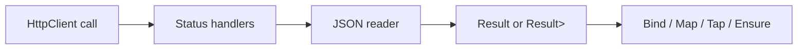

# HTTP Integration

**Level:** Beginner 📗 | **Time:** 15-20 min | **Prerequisites:** [Basics](basics.md)

When you call another HTTP service, the hard part is rarely `HttpClient`. The hard part is turning status codes, empty bodies, and bad payloads into errors your application can reason about.

`Trellis.Http` gives you that bridge. You keep using `HttpClient`, but you can map responses into `Result<T>` and `Result<Maybe<T>>` without falling back to exception-driven flow.

## What problem does this solve?

Without Trellis, HTTP client code often turns into a mix of:

- `EnsureSuccessStatusCode()`
- manual `if (response.StatusCode == ...)`
- ad-hoc JSON null checks
- exception handling that leaks transport concerns into business code

With Trellis, you can describe the outcomes you expect and keep composing with the rest of your result pipeline.



## Installation

```bash
dotnet add package Trellis.Http
```

## Quick start

Start with the most common case: call an endpoint, map one expected status code, then deserialize JSON.

```csharp
using System.Net.Http.Json;
using System.Text.Json.Serialization;
using Trellis;
using Trellis.Http;

[JsonSerializable(typeof(UserDto))]
internal partial class ApiJsonContext : JsonSerializerContext
{
}

public sealed record UserDto(string Id, string DisplayName);

public sealed class UserDirectoryClient(HttpClient httpClient)
{
    public async Task<Result<UserDto>> GetUserAsync(
        string userId,
        CancellationToken cancellationToken)
    {
        return await httpClient.GetAsync($"users/{userId}", cancellationToken)
            .HandleNotFoundAsync(new Error.NotFound(new ResourceRef("Resource", userId)) { Detail = $"User {userId} not found" })
            .ReadResultFromJsonAsync(ApiJsonContext.Default.UserDto, cancellationToken);
    }
}
```

> [!TIP]
> `ReadResultFromJsonAsync<T>` requires `T : notnull`. In practice, that means these helpers are for real payload types, not nullable reference types.

## Status handling

Why handle status codes before deserializing? Because it keeps transport failures obvious and prevents “try to read JSON from an error page” bugs.

### Specific status handlers

Use these when you know which failures are part of the contract.

| Handler | HTTP status | Produces |
| --- | --- | --- |
| `HandleNotFound` | `404` | `Error.NotFound` |
| `HandleUnauthorized` | `401` | `Error.Unauthorized` |
| `HandleForbidden` | `403` | `Error.Forbidden` |
| `HandleConflict` | `409` | `Error.Conflict` |

Each handler has async overloads for:

- `Task<HttpResponseMessage>`
- `Task<Result<HttpResponseMessage>>`

That means you can keep chaining even after you already wrapped a response in `Result<HttpResponseMessage>`.

```csharp
using System.Net.Http.Json;
using System.Text.Json.Serialization;
using Trellis;
using Trellis.Http;

[JsonSerializable(typeof(CreateOrderRequest))]
[JsonSerializable(typeof(OrderDto))]
internal partial class OrdersJsonContext : JsonSerializerContext
{
}

public sealed record CreateOrderRequest(string CustomerId, decimal Total);
public sealed record OrderDto(string Id, decimal Total);

public sealed class OrdersClient(HttpClient httpClient)
{
    public async Task<Result<OrderDto>> CreateAsync(
        CreateOrderRequest request,
        CancellationToken cancellationToken)
    {
        return await httpClient.PostAsJsonAsync(
                "orders",
                request,
                OrdersJsonContext.Default.CreateOrderRequest,
                cancellationToken)
            .HandleUnauthorizedAsync(new Error.Unauthorized() { Detail = "Sign in before creating orders." })
            .HandleForbiddenAsync(new Error.Forbidden("policy.id") { Detail = "You are not allowed to create orders." })
            .HandleConflictAsync(new Error.Conflict(null, "conflict") { Detail = "An order with the same id already exists." })
            .ReadResultFromJsonAsync(OrdersJsonContext.Default.OrderDto, cancellationToken);
    }
}
```

### Range handlers

Use range handlers when you want a fallback for “some other 4xx” or “some other 5xx”.

```csharp
using System.Net;
using System.Net.Http.Json;
using System.Text.Json.Serialization;
using Trellis;
using Trellis.Http;

[JsonSerializable(typeof(ProductDto))]
internal partial class ProductsJsonContext : JsonSerializerContext
{
}

public sealed record ProductDto(string Id, string Name);

public sealed class ProductsClient(HttpClient httpClient)
{
    public async Task<Result<ProductDto>> GetAsync(
        string productId,
        CancellationToken cancellationToken)
    {
        return await httpClient.GetAsync($"products/{productId}", cancellationToken)
            .HandleNotFoundAsync(new Error.NotFound(new ResourceRef("Resource", productId)) { Detail = $"Product {productId} not found" })
            .HandleClientErrorAsync(statusCode => statusCode switch
            {
                HttpStatusCode.BadRequest => new Error.BadRequest("bad.request") { Detail = "The product request was invalid." },
                _ => new Error.InternalServerError("fault-id") { Detail = $"Unexpected client error: {(int)statusCode}." }
            })
            .HandleServerErrorAsync(statusCode =>
                Error.ServiceUnavailable($"Product service failed with {(int)statusCode}."))
            .ReadResultFromJsonAsync(ProductsJsonContext.Default.ProductDto, cancellationToken);
    }
}
```

> [!NOTE]
> Order matters. Put the specific handlers first, then the range-based fallback handlers.

### `EnsureSuccess`

Use `EnsureSuccess` when you do not care about differentiating individual failure codes and just want a result instead of an exception.

```csharp
using Trellis;
using Trellis.Http;

public sealed class CacheClient(HttpClient httpClient)
{
    public async Task<Result<HttpResponseMessage>> PurgeAsync(
        string cacheKey,
        CancellationToken cancellationToken)
    {
        return await httpClient.DeleteAsync($"cache/{cacheKey}", cancellationToken)
            .EnsureSuccessAsync(statusCode =>
                new Error.InternalServerError("fault-id") { Detail = $"Cache purge failed with status {(int)statusCode}." });
    }
}
```

## Reading JSON

Why split this into two helpers? Because “missing payload is a bug” and “missing payload is acceptable” are different cases.

### `ReadResultFromJsonAsync`

Choose this when a payload is required.

- non-success status → failure
- `204 NoContent` / `205 ResetContent` → failure
- JSON `null` → failure
- invalid JSON → failure

```csharp
using System.Text.Json.Serialization;
using Trellis;
using Trellis.Http;

[JsonSerializable(typeof(CustomerDto))]
internal partial class CustomersJsonContext : JsonSerializerContext
{
}

public sealed record CustomerDto(string Id, string Name);

public sealed class CustomersClient(HttpClient httpClient)
{
    public async Task<Result<CustomerDto>> GetAsync(
        string customerId,
        CancellationToken cancellationToken)
    {
        return await httpClient.GetAsync($"customers/{customerId}", cancellationToken)
            .ReadResultFromJsonAsync(CustomersJsonContext.Default.CustomerDto, cancellationToken);
    }
}
```

### `ReadResultMaybeFromJsonAsync`

Choose this when “no payload” is a valid outcome.

- non-success status → failure
- `204`, `205`, empty content, or JSON `null` → `Success(Maybe.None)`
- valid JSON body → `Success(Maybe.From(value))`

```csharp
using System.Text.Json.Serialization;
using Trellis;
using Trellis.Http;

[JsonSerializable(typeof(UserProfileDto))]
internal partial class ProfilesJsonContext : JsonSerializerContext
{
}

public sealed record UserProfileDto(string Bio);

public sealed class ProfilesClient(HttpClient httpClient)
{
    public async Task<Result<Maybe<UserProfileDto>>> GetAsync(
        string userId,
        CancellationToken cancellationToken)
    {
        return await httpClient.GetAsync($"users/{userId}/profile", cancellationToken)
            .ReadResultMaybeFromJsonAsync(ProfilesJsonContext.Default.UserProfileDto, cancellationToken);
    }
}
```

> [!WARNING]
> `ReadResultMaybeFromJsonAsync` does **not** catch `JsonException`. Use it when “optional body” is allowed, not when you want malformed JSON silently treated as “no value”.

## When you need the raw response

Sometimes status code alone is not enough. `HandleFailureAsync` lets you inspect the response body and build a richer error.

```csharp
using System.Net;
using System.Net.Http.Json;
using System.Text.Json.Serialization;
using Trellis;
using Trellis.Http;

[JsonSerializable(typeof(CreateInvoiceRequest))]
[JsonSerializable(typeof(InvoiceDto))]
internal partial class InvoicesJsonContext : JsonSerializerContext
{
}

public sealed record CreateInvoiceRequest(string CustomerId, decimal Amount);
public sealed record InvoiceDto(string Id, decimal Amount);

public sealed class InvoicesClient(HttpClient httpClient)
{
    public async Task<Result<InvoiceDto>> CreateAsync(
        CreateInvoiceRequest request,
        CancellationToken cancellationToken)
    {
        return await httpClient.PostAsJsonAsync(
                "invoices",
                request,
                InvoicesJsonContext.Default.CreateInvoiceRequest,
                cancellationToken)
            .HandleFailureAsync(
                async (response, _, ct) =>
                {
                    var body = await response.Content.ReadAsStringAsync(ct);

                    return response.StatusCode switch
                    {
                        HttpStatusCode.BadRequest => new Error.BadRequest("bad.request") { Detail = body },
                        HttpStatusCode.Conflict => new Error.Conflict(null, "conflict") { Detail = body },
                        _ => new Error.InternalServerError("fault-id") { Detail = $"Invoice request failed with {(int)response.StatusCode}: {body}" }
                    };
                },
                context: 0,
                cancellationToken)
            .ReadResultFromJsonAsync(InvoicesJsonContext.Default.InvoiceDto, cancellationToken);
    }
}
```

## Composing HTTP with the rest of Trellis

This is the main payoff: once the HTTP call becomes `Result<T>`, it fits naturally into the rest of your workflow.

```csharp
using System.Text.Json.Serialization;
using Trellis;
using Trellis.Http;

[JsonSerializable(typeof(InventoryCheckDto))]
[JsonSerializable(typeof(PaymentReceiptDto))]
internal partial class CheckoutJsonContext : JsonSerializerContext
{
}

public sealed record InventoryCheckDto(bool InStock);
public sealed record PaymentReceiptDto(string ReceiptId);

public sealed class CheckoutService(HttpClient httpClient)
{
    public async Task<Result<PaymentReceiptDto>> ChargeAsync(
        string productId,
        CancellationToken cancellationToken)
    {
        return await httpClient.GetAsync($"inventory/{productId}", cancellationToken)
            .ReadResultFromJsonAsync(CheckoutJsonContext.Default.InventoryCheckDto, cancellationToken)
            .EnsureAsync(
                inventory => inventory.InStock,
                new Error.UnprocessableContent(EquatableArray.Create(new FieldViolation(InputPointer.ForProperty(nameof(productId)), "validation.error") { Detail = "The product is out of stock." })))
            .BindAsync(
                (_, ct) => httpClient.PostAsync($"payments/{productId}", null, ct)
                    .ReadResultFromJsonAsync(CheckoutJsonContext.Default.PaymentReceiptDto, ct),
                cancellationToken);
    }
}
```

## Practical guidance

### Prefer source-generated JSON metadata

It keeps your examples AOT-friendly and matches the overloads Trellis is designed to work with.

### Handle expected failures explicitly

If `404` is part of normal control flow, map it with `HandleNotFoundAsync` instead of collapsing everything into `EnsureSuccessAsync`.

### Always pass the `CancellationToken`

Every Trellis HTTP helper accepts it for a reason. Pass it all the way through.

### Remember Trellis error codes

Default codes end in `.error`, for example:

- `not.found.error`
- `forbidden.error`
- `validation.error`

That is useful when you log or assert on machine-readable failures.

## Next steps

- [Mediator Pipeline](integration-mediator.md)
- [Testing](integration-testing.md)
- [Error Handling](error-handling.md)
- [trellis-api-http.md](../api_reference/trellis-api-http.md)
