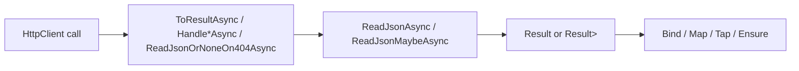

# HTTP Integration

**Level:** Beginner 📗 | **Time:** 10-15 min | **Prerequisites:** [Basics](basics.md)

When you call another HTTP service, the hard part is rarely `HttpClient`. The hard part is turning status codes, empty bodies, and bad payloads into errors your application can reason about.

`Trellis.Http` gives you that bridge. You keep using `HttpClient`, but you can map responses into `Result<T>` and `Result<Maybe<T>>` without falling back to exception-driven flow.

## What problem does this solve?

Without Trellis, HTTP client code often turns into a mix of:

- `EnsureSuccessStatusCode()`
- manual `if (response.StatusCode == ...)`
- ad-hoc JSON null checks
- exception handling that leaks transport concerns into business code

With Trellis, you describe the outcomes you expect and keep composing with the rest of your result pipeline.



## Installation

```bash
dotnet add package Trellis.Http
```

## The v3 surface

`Trellis.Http` is a single static class &mdash; `HttpResponseExtensions` &mdash; with a small canonical method set.

| Method | Receiver | Purpose |
| --- | --- | --- |
| `ToResultAsync(statusMap?)` | `Task<HttpResponseMessage>` | Bridge into `Task<Result<HttpResponseMessage>>`. With no map, 2xx stays `Ok` and non-2xx becomes a typed Trellis failure. With a map, return `null` to pass through. |
| `ToResultAsync(mapper, ct)` | `Task<HttpResponseMessage>` | Body-aware bridge. Async mapper invoked only on non-success status codes. Replaces the v1 `HandleFailureAsync<TContext>`. |
| `HandleNotFoundAsync(error)` | `Task<HttpResponseMessage>` | Map 404 to `Fail`. |
| `HandleConflictAsync(error)` | `Task<HttpResponseMessage>` | Map 409 to `Fail`. |
| `HandleUnauthorizedAsync(error)` | `Task<HttpResponseMessage>` | Map 401 to `Fail`. |
| `ReadJsonAsync<T>(jsonTypeInfo, ct)` | `Task<Result<HttpResponseMessage>>` | Read and deserialize the body. Required-payload semantics: empty / `null` / invalid JSON / `204` / `205` &rarr; `Fail`. |
| `ReadJsonMaybeAsync<T>(jsonTypeInfo, ct)` | `Task<Result<HttpResponseMessage>>` | Optional-payload variant. `204`, `205`, empty body, JSON `null` &rarr; `Ok(Maybe.None)`. Invalid JSON throws `JsonException` (intentional). |
| `ReadJsonOrNoneOn404Async<T>(jsonTypeInfo, ct)` | `Task<HttpResponseMessage>` | Terminal optional-resource variant. `404` &rarr; `Ok(Maybe.None)`; other non-2xx statuses use strict mapping. |

> [!TIP]
> `ReadJsonAsync<T>` and `ReadJsonMaybeAsync<T>` require `T : notnull`. Use them with real payload types, not nullable reference types.

## Quick start

The most common case: call an endpoint, map one expected status code, then deserialize JSON.

```csharp
using System.Text.Json.Serialization;
using Trellis;
using Trellis.Http;

[JsonSerializable(typeof(UserDto))]
internal partial class ApiJsonContext : JsonSerializerContext { }

public sealed record UserDto(string Id, string DisplayName);

public sealed class UserDirectoryClient(HttpClient httpClient)
{
    public Task<Result<UserDto>> GetUserAsync(string userId, CancellationToken cancellationToken) =>
        httpClient.GetAsync($"users/{userId}", cancellationToken)
            .HandleNotFoundAsync(new Error.NotFound(ResourceRef.For<UserDto>(userId)) { Detail = $"User {userId} not found" })
            .ReadJsonAsync(ApiJsonContext.Default.UserDto, cancellationToken);
}
```

## Status handling

Why handle status codes before deserializing? Because it keeps transport failures obvious and prevents "try to read JSON from an error page" bugs.

### Single-status convenience handlers

Use these when you know which failures are part of the contract.

| Handler | HTTP status | Produces |
| --- | --- | --- |
| `HandleNotFoundAsync` | `404` | `Error.NotFound` |
| `HandleUnauthorizedAsync` | `401` | `Error.Unauthorized` |
| `HandleConflictAsync` | `409` | `Error.Conflict` |

Each handler operates on `Task<HttpResponseMessage>` &mdash; the *entry point* of the chain. After it the result is `Task<Result<HttpResponseMessage>>` and the next operator is `ReadJsonAsync` / `ReadJsonMaybeAsync`.

```csharp
using System.Net.Http.Json;
using System.Text.Json.Serialization;
using Trellis;
using Trellis.Http;

[JsonSerializable(typeof(CreateOrderRequest))]
[JsonSerializable(typeof(OrderDto))]
internal partial class OrdersJsonContext : JsonSerializerContext { }

public sealed record CreateOrderRequest(string CustomerId, decimal Total);
public sealed record OrderDto(string Id, decimal Total);

public sealed class OrdersClient(HttpClient httpClient)
{
    public Task<Result<OrderDto>> CreateAsync(CreateOrderRequest request, CancellationToken ct) =>
        httpClient.PostAsJsonAsync("orders", request, OrdersJsonContext.Default.CreateOrderRequest, ct)
            .HandleUnauthorizedAsync(new Error.Unauthorized() { Detail = "Sign in before creating orders." })
            .ReadJsonAsync(OrdersJsonContext.Default.OrderDto, ct);
}
```

### Multi-status mapping with `ToResultAsync(statusMap)`

Use `ToResultAsync` with a `Func<HttpStatusCode, Error?>` when you need to map multiple statuses, including 403, ranges, or "everything that is not 2xx". Returning `null` lets the response flow through; returning an `Error` short-circuits the chain.

```csharp
using System.Net;

public sealed class ProductsClient(HttpClient httpClient)
{
    public Task<Result<ProductDto>> GetAsync(string productId, CancellationToken ct) =>
        httpClient.GetAsync($"products/{productId}", ct)
            .ToResultAsync(status => status switch
            {
                HttpStatusCode.NotFound  => new Error.NotFound(ResourceRef.For<ProductDto>(productId)),
                HttpStatusCode.Forbidden => new Error.Forbidden("products.read"),
                _ when (int)status >= 500 => new Error.InternalServerError(Guid.NewGuid().ToString("N")) { Detail = $"upstream {status}" },
                _ when (int)status >= 400 => new Error.InternalServerError(Guid.NewGuid().ToString("N")) { Detail = $"client error {status}" },
                _ => null,
            })
            .ReadJsonAsync(ProductsJsonContext.Default.ProductDto, ct);
}
```

This single primitive subsumes the v1 `HandleClientError`, `HandleServerError`, `HandleForbidden`, and `EnsureSuccess` verbs.

### Body-aware mapping with `ToResultAsync(mapper, ct)`

When status code alone is not enough, supply a `Func<HttpResponseMessage, CancellationToken, Task<Error?>>`. The mapper is invoked **only** for non-success responses and may read the body, headers, or problem-details payload to build a richer error.

```csharp
using System.Net;
using System.Net.Http.Json;

public sealed class InvoicesClient(HttpClient httpClient)
{
    public Task<Result<InvoiceDto>> CreateAsync(CreateInvoiceRequest request, CancellationToken ct) =>
        httpClient.PostAsJsonAsync("invoices", request, InvoicesJsonContext.Default.CreateInvoiceRequest, ct)
            .ToResultAsync(async (response, token) =>
            {
                var body = await response.Content.ReadAsStringAsync(token);
                return response.StatusCode switch
                {
                    HttpStatusCode.Conflict   => new Error.Conflict(null, "conflict") { Detail = body },
                    HttpStatusCode.BadRequest => new Error.BadRequest("bad-req") { Detail = body },
                    _ => new Error.InternalServerError("upstream") { Detail = $"Invoice request failed with {(int)response.StatusCode}: {body}" },
                };
            }, ct)
            .ReadJsonAsync(InvoicesJsonContext.Default.InvoiceDto, ct);
}
```

Capture additional caller state via closure &mdash; the v1 `TContext` channel is gone (it was redundant).

## Reading JSON

Why split this into two helpers? Because "missing payload is a bug" and "missing payload is acceptable" are different cases.

### `ReadJsonAsync` &mdash; payload required

- non-success status &rarr; `Fail<InternalServerError>`
- `204 NoContent` / `205 ResetContent` &rarr; `Fail`
- `null`, empty body, or invalid JSON &rarr; `Fail`

### `ReadJsonMaybeAsync` &mdash; payload optional

- non-success status &rarr; `Fail<InternalServerError>`
- `204`, `205`, empty content, JSON `null` &rarr; `Ok(Maybe.None)`
- valid JSON body &rarr; `Ok(Maybe.From(value))`

### `ReadJsonOrNoneOn404Async` &mdash; resource optional

- `404 NotFound` &rarr; `Ok(Maybe.None)`
- other non-success status &rarr; typed Trellis failure via strict status mapping
- `204`, `205`, empty content, JSON `null` &rarr; `Ok(Maybe.None)`
- valid JSON body &rarr; `Ok(Maybe.From(value))`

> [!WARNING]
> `ReadJsonMaybeAsync` does **not** catch `JsonException`. Use it when "optional body" is allowed, not when you want malformed JSON silently treated as "no value". The response is still disposed before the exception escapes.

## Disposal contract

The library owns `HttpResponseMessage` disposal on terminal or transformative paths:

- `ToResultAsync` (both overloads) and `Handle*Async` dispose the response on the `Fail` path.
- `ReadJsonAsync`, `ReadJsonMaybeAsync`, and `ReadJsonOrNoneOn404Async` always dispose after reading, success or failure.
- Pass-through paths (success from bare `ToResultAsync`, non-matching `Handle*Async`, mapper returning `null`) leave disposal to the caller until the chain reaches `ReadJson*`.

In practice: **once you call `ReadJson*`, you no longer need to dispose the response yourself.**

## Composing HTTP with the rest of Trellis

Once an HTTP call becomes `Result<T>`, it composes naturally with `Bind`, `Map`, `Ensure`, etc.:

```csharp
public Task<Result<PaymentReceiptDto>> ChargeAsync(string productId, CancellationToken ct) =>
    httpClient.GetAsync($"inventory/{productId}", ct)
        .ToResultAsync()
        .ReadJsonAsync(CheckoutJsonContext.Default.InventoryCheckDto, ct)
        .EnsureAsync(
            inventory => inventory.InStock,
            new Error.UnprocessableContent(EquatableArray.Create(new FieldViolation(InputPointer.ForProperty(nameof(productId)), "validation.error") { Detail = "Out of stock." })))
        .BindAsync(
            (_, token) => httpClient.PostAsync($"payments/{productId}", null, token)
                .ToResultAsync()
                .ReadJsonAsync(CheckoutJsonContext.Default.PaymentReceiptDto, token),
            ct);
```

## Practical guidance

- **Prefer source-generated JSON metadata** &mdash; keeps the chain AOT-friendly and matches the `JsonTypeInfo<T>` overloads.
- **Use optional reads intentionally.** If `404` means absence, use `ReadJsonOrNoneOn404Async`; if it is an error, let bare `ToResultAsync()` produce a failure or map it with `HandleNotFoundAsync`.
- **Always pass the `CancellationToken`.** Every Trellis HTTP helper accepts it for a reason.
- **Need a sync receiver?** Wrap with `Task.FromResult(response)`. In practice every `HttpClient` call is already async, so this is rarely necessary.

## Breaking changes from v1

The v1 surface (60+ overloads) has been collapsed. The deleted verbs &mdash; `HandleForbidden*`, `HandleClientError*`, `HandleServerError*`, `EnsureSuccess` / `EnsureSuccessAsync`, `HandleFailureAsync<TContext>`, every sync overload, every `Result<HttpResponseMessage>`-receiver overload &mdash; are all expressible with `ToResultAsync(statusMap)` or `ToResultAsync(mapper, ct)`. The renamed verbs are `ReadResultFromJsonAsync` &rarr; `ReadJsonAsync` and `ReadResultMaybeFromJsonAsync` &rarr; `ReadJsonMaybeAsync`. See the [API reference](../api_reference/trellis-api-http.md#breaking-changes-from-v1) for the full migration table.
