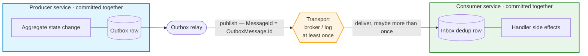
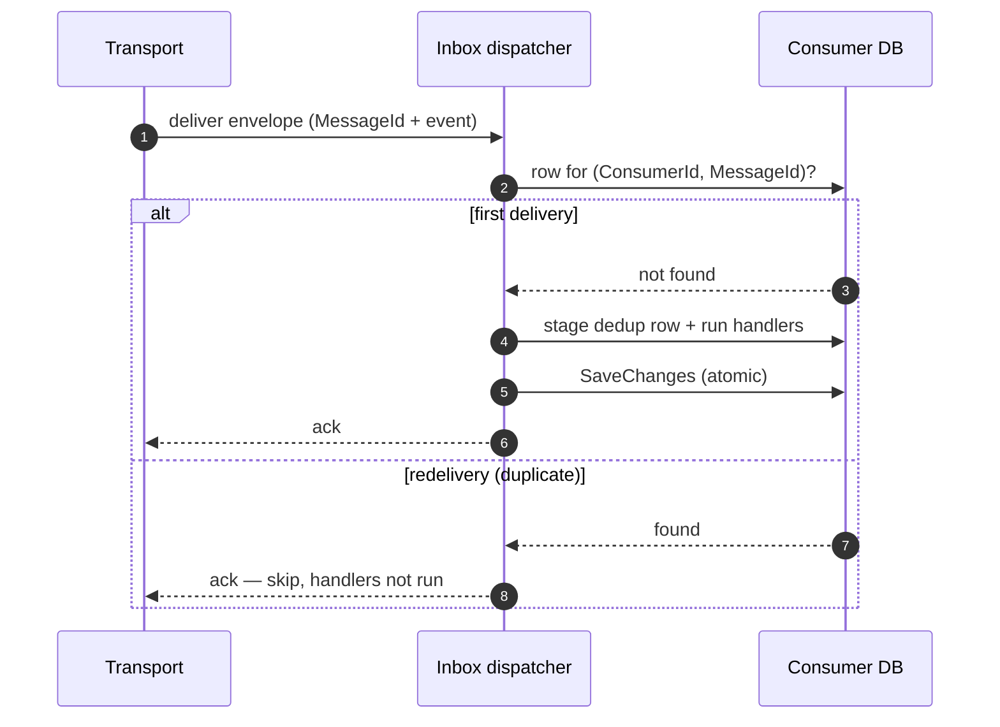
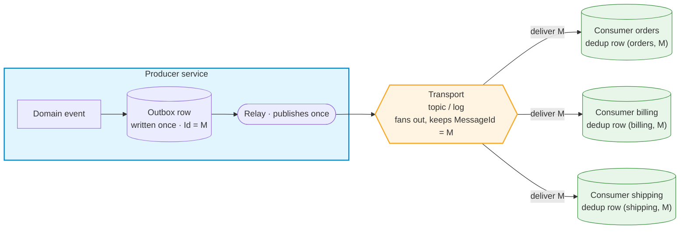

---
title: Transactional Inbox Integration
package: Trellis.EntityFrameworkCore.Inbox
topics: [inbox, integration-events, idempotency, efcore, messaging, reliability]
related_api_reference: [trellis-api-efcore-inbox.md, trellis-api-efcore-outbox.md, trellis-api-efcore.md, trellis-api-mediator.md]
last_verified: 2026-06-20
audience: [developer]
---
# Transactional Inbox Integration

`Trellis.EntityFrameworkCore.Inbox` makes consuming integration events **idempotent**. It is the consume-side complement to the [transactional outbox](integration-outbox.md): the outbox guarantees a message is *published* at least once, and the inbox guarantees that — no matter how many times it is delivered — its handlers' local side effects are *applied* exactly once. The proof of processing and the side effects commit together, in one database transaction, or not at all.

## The big picture



Two atomic boxes joined by an unreliable wire. The **producer** commits its state change and the outbox row in one transaction, and a relay publishes the row after the commit. The **transport** in between may deliver the same message more than once. The **consumer's** inbox commits a dedup row and its handlers' side effects in one `SaveChanges`, so a repeat delivery finds the dedup row and is skipped. The producer's `OutboxMessage.Id` rides along as the `MessageId` that ties every delivery back to its origin.

## Why you need it

Every durable transport delivers **at least once**. A broker redelivers when a consumer's lock renewal times out; a log-based transport replays from an offset after a restart; an at-least-once outbox re-publishes a message whose acknowledgement was lost. So your consumer *will* see the same message twice, and the second time it must not charge the card again, send the second confirmation email, or write the duplicate ledger row.

The usual fix — "check if we've already handled this id" — is only correct if the check and the work commit atomically. Do them in two steps and a crash in between either reprocesses (you checked, then died before recording) or drops (you recorded, then died before the work). The inbox makes the dedup record and the work part of the **same transaction**, so they are inseparable.

## The wiring

The inbox has a table-mapping half (on the `DbContext`) and a service half (in the container). Both are required, plus a transport adapter that feeds messages in.

```csharp
public sealed class AppDbContext : DbContext
{
    // 1. Map the TrellisInboxMessages dedup table.
    protected override void OnModelCreating(ModelBuilder modelBuilder)
    {
        base.OnModelCreating(modelBuilder);
        modelBuilder.AddTrellisInbox();
    }
}

// 2. Register the dispatcher, store, and options — plus the handlers that consume the events.
builder.Services.AddTrellis(trellis => trellis
    .UseIntegrationEvents(typeof(Program).Assembly)   // your IIntegrationEventHandler<T> consumers
    .UseEntityFrameworkUnitOfWork<AppDbContext>()
    .UseInbox<AppDbContext>(o => o.ConsumerId = "orders-service"));
```

`ConsumerId` identifies this subscriber. Two different services consuming the same message each keep their own dedup history under their own `ConsumerId`, so each processes it once. Keep the value stable across deploys — it is part of the dedup key, and renaming it makes the consumer reprocess everything still inside the transport's redelivery window.

Then an **application-owned** transport adapter turns each received message into an `IntegrationEnvelope` and hands it to the dispatcher:

```csharp
public sealed class OrdersBrokerConsumer(IInboxDispatcher inbox)
{
    public Task OnMessageAsync(TransportMessage raw, CancellationToken ct)
    {
        var envelope = new IntegrationEnvelope(raw.MessageId, Deserialize(raw))
        {
            MessageSource = raw.SourceService,   // optional lineage / observability
            CorrelationId = raw.CorrelationId,
        };
        return inbox.DispatchAsync(envelope, ct);
    }
}
```

Trellis deliberately does **not** ship a broker adapter — there are too many transports (Service Bus, Event Hubs, Kafka, SQS, an HTTP webhook) to bless one. The inbox gives you the `IInboxDispatcher` seam to call and the `IInboxStore` seam to re-back with a non-EF store; the few lines that read your broker are yours.

> Prefer raw DI over the builder? Call `services.AddTrellisInbox<AppDbContext>(o => o.ConsumerId = "orders-service")` directly instead of `.UseInbox<AppDbContext>()`. The table wiring (step 1) is identical; the `UseInbox` slot simply also fails fast if you configure the inbox twice.

## How it works

`DispatchAsync` runs one short unit of work per message:

1. **Open a unit of work.** The dispatcher creates a DI scope and resolves your `TContext` and the inbox store.
2. **Deduplicate.** It asks the store whether a row already exists for this `(ConsumerId, MessageId)`. If it does, the message was already processed — the dispatcher returns having staged nothing, and the adapter acknowledges the redelivery.
3. **Run the handlers.** Otherwise it stages a dedup row (without saving) and fans the event out to every `IIntegrationEventHandler<T>` for its type, resolved from the *same* scope. A handler that injects `TContext` therefore writes through the same context that holds the staged dedup row. Handlers stage their changes for the dispatcher to commit — they must **not** call `SaveChanges` themselves, which would persist the dedup row early and break the single-save atomicity.
4. **Commit.** One `SaveChanges` persists the dedup row and the handler writes together, atomically, under EF Core's implicit transaction. The handlers run *before* this save, so a handler throw leaves nothing persisted and the transport redelivers.

Because the dedup proof and the work land in the same `SaveChanges`, there is no window where one exists without the other. And because the inbox opens no user-initiated transaction, it composes with a retrying execution strategy (`EnableRetryOnFailure`) like the rest of Trellis.



## Delivery is at-least-once; processing is effectively-once

This is the distinction that matters:

- A **handler failure leaves nothing persisted and redelivers.** Unlike the default integration-event publisher — which logs and swallows handler exceptions — the inbox is *non-swallowing* by design. The handlers run before the save, so if one throws, nothing has been persisted (no dedup row, no side effects) and the exception propagates out of `DispatchAsync`, so your adapter lets the transport redeliver and the message is reprocessed cleanly later. The inbox itself does not retry or dead-letter; that is the transport's job, and brokers already do it well.
- **Concurrent deliveries are resolved by the primary key.** If the same message arrives twice at once (two consumer instances, or a redelivery overlapping the original), both may pass the existence check, but only one `SaveChanges` can insert the `(ConsumerId, MessageId)` row — the other fails with a duplicate-key violation on that row, which the dispatcher recognizes and treats as "already processed". Exactly one delivery applies the side effects; the loser's staged writes are discarded with the failed save.

## What "exactly once" really means here

The inbox guarantees exactly-once application of **local, transactional** side effects — the writes your handlers make through the injected `DbContext`. It cannot make a non-transactional effect exactly-once:

- Sending an email, calling a downstream HTTP API, or publishing to another broker happens *outside* the database `SaveChanges`. If the external call succeeds but the save then fails or rolls back — a later handler throws, the connection drops, or a concurrent duplicate wins the race — no dedup row is written, so the transport redelivers and the handler runs again, repeating the external call. Conversely, once the dedup row commits the message is never re-run, so an external effect that failed *after* a successful commit is not retried.
- For those, keep the handler idempotent on its own terms — make the downstream call with an idempotency key, or record "email sent" as a transactional side effect and let a separate outbox actually send it.

A useful rule of thumb: **do transactional work in the inbox handler; push non-transactional work back out through an outbox.** The two patterns compose — the inbox makes consumption idempotent, the outbox makes the consumer's own emissions reliable.

## Choosing the MessageId

Dedup is only as good as the id. The `MessageId` must be **stable across redeliveries** — the same logical message must carry the same id every time it is delivered. The natural choice is the producer's outbox id: `OutboxMessage.Id` is a UUIDv7 minted once when the event is captured, and a well-behaved transport carries it verbatim in the message metadata. Read it back in your adapter and use it as the envelope `MessageId`.

Do **not** use a per-delivery id the transport mints fresh on each attempt (some brokers assign a new sequence number per delivery) — every redelivery would look new and defeat the inbox. The envelope's other fields — `MessageSource`, `CausationId`, `CorrelationId` — are lineage and observability only; they are recorded for audit but never affect dedup.

## One message, many consumers

The outbox writes a message **once** — fanning it out to multiple consumers is the broker's job, not the outbox's. A topic (or a log read by several consumer-groups) delivers a copy to each subscriber, and every copy carries the **same `MessageId`**. Each consumer keeps its own `ConsumerId`, so the dedup key `(ConsumerId, MessageId)` gives every consumer an independent row — one effective processing each, with its own retries and its own failures.



Three consumers are shown; the same fan-out covers any number — five, fifty. The producer is unchanged either way: it still writes a single outbox row and the relay still publishes it once. You add or remove consumers by adding or removing subscriptions on the transport, and each new consumer simply starts its own dedup history under its own `ConsumerId`.

That is a different axis from scaling *one* consumer to several **instances**: those instances share one `ConsumerId` and one database, and the composite primary key makes exactly one instance win a concurrent or redelivered duplicate — no leader election needed. Fan-out (many `ConsumerId`s) and scale-out (many instances of one `ConsumerId`) compose freely.

## Operating the inbox

- **Prune old rows.** `TrellisInboxMessages` grows by one row per processed message per consumer. Once a row is older than the transport's maximum redelivery window it can never be hit by a redelivery, so a periodic job can delete rows whose `ProcessedAt` is older than that window (the column is indexed for exactly this). Delete too eagerly and a late redelivery would reprocess.
- **Keep `ConsumerId` stable.** Treat it like a schema decision. Changing it is equivalent to declaring a brand-new subscriber with empty dedup history.
- **One inbox per composition.** `UseInbox<TContext>()` throws if called twice. A process that consumes for several logical subscribers models them as distinct handlers under one `ConsumerId`, or composes separate roots.
- **Make handlers re-runnable.** Redelivery after a failure reprocesses from scratch, so a handler must tolerate being started, rolled back, and started again.

## Inbox vs. outbox

They are two halves of reliable messaging and frequently used together:

| | Outbox | Inbox |
|---|---|---|
| Side | Produce | Consume |
| Problem solved | Don't lose a message between commit and publish | Don't apply a redelivered message twice |
| Guarantee | At-least-once delivery | Effectively-once processing (local side effects) |
| Trellis ships | The capture interceptor + background relay | The dispatcher + EF dedup store + table |
| You own | Optionally, the broker adapter that sends | The transport adapter that receives |

The producer captures an event atomically with its state change and the relay publishes it (at least once); the consumer's inbox deduplicates the deliveries (to one effective processing). The `OutboxMessage.Id` carried across the wire is the thread that ties them together.

## Related guides

- [Transactional Outbox Integration](integration-outbox.md) — the produce-side complement, and where the `MessageId` comes from.
- [Entity Framework Core Integration](integration-ef.md) — the `DbContext`, unit of work, and transactions the inbox builds on.
- [Mediator Pipeline](integration-mediator.md) — the `IIntegrationEvent` / `IIntegrationEventHandler<T>` contracts the inbox fans out to.
