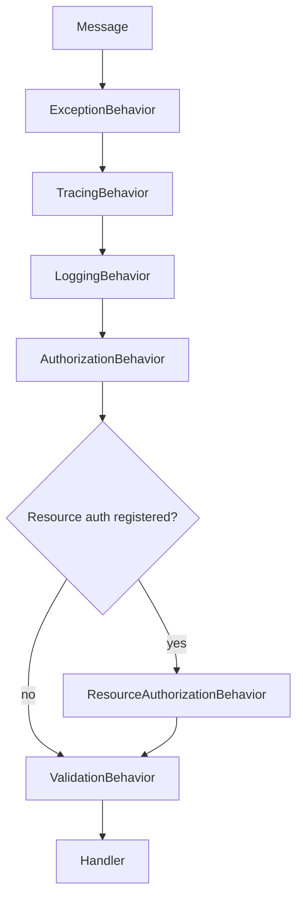

# Mediator Pipeline

**Level:** Intermediate 📘 | **Time:** 20-25 min | **Prerequisites:** [Basics](basics.md), [ASP.NET Core Authorization](integration-asp-authorization.md)

Handlers should focus on business work. Authorization, validation, tracing, and exception safety should happen around them, not inside them.

That is what `Trellis.Mediator` gives you: result-aware pipeline behaviors for the [Mediator](https://github.com/martinothamar/Mediator) library.

## Why use it?

Without a pipeline, handlers tend to accumulate cross-cutting concerns:

- permission checks
- resource ownership checks
- input validation
- trace/log boilerplate
- try/catch safety nets

With `Trellis.Mediator`, those concerns become opt-in behaviors.



## Installation

```bash
dotnet add package Trellis.Mediator
```

## Quick start

Start by registering Mediator and the core Trellis behaviors.

```csharp
using Trellis.Mediator;

var builder = WebApplication.CreateBuilder(args);

builder.Services.AddMediator();
builder.Services.AddTrellisBehaviors();
```

That registration adds these behaviors, in this order:

| Behavior | Runs for | What it does |
| --- | --- | --- |
| `ExceptionBehavior` | all messages | Converts unhandled exceptions into `Error.Unexpected(...)` failures |
| `TracingBehavior` | all messages | Creates an OpenTelemetry activity |
| `LoggingBehavior` | all messages | Logs execution and failures |
| `AuthorizationBehavior` | messages implementing `IAuthorize` | Enforces required permissions |
| `ValidationBehavior` | messages implementing `IValidate` | Returns whatever `Validate()` returns on failure |

> [!NOTE]
> `ResourceAuthorizationBehavior` is **not** included by `AddTrellisBehaviors()`. It is only added when you call `AddResourceAuthorization(...)`.

## Permission-based authorization

Use `IAuthorize` when a command or query always needs the same permission set.

```csharp
using Mediator;
using Trellis;
using Trellis.Authorization;

public sealed record PublishDocumentCommand(Guid DocumentId)
    : ICommand<Result<Unit>>, IAuthorize
{
    public IReadOnlyList<string> RequiredPermissions => ["Documents.Publish"];
}
```

When this command goes through the pipeline:

1. `AuthorizationBehavior` asks `IActorProvider` for the current actor
2. it calls `actor.HasAllPermissions(RequiredPermissions)`
3. if the actor is missing any permission, the pipeline returns `Error.Forbidden("Insufficient permissions.")`

## Resource-based authorization

Static permissions are not enough when the answer depends on the resource itself. For example: “the caller must have `Documents.Edit`, and they must own this document.”

### Step 1: put the rule on the message

```csharp
using Mediator;
using Trellis;
using Trellis.Authorization;
using Trellis.Mediator;

public sealed record Document(Guid Id, string OwnerId, string Title);

public sealed record RenameDocumentCommand(Guid DocumentId, string Title)
    : ICommand<Result<Document>>,
      IAuthorize,
      IAuthorizeResource<Document>,
      IValidate
{
    public IReadOnlyList<string> RequiredPermissions => ["Documents.Edit"];

    public IResult Authorize(Actor actor, Document resource) =>
        actor.IsOwner(resource.OwnerId)
            ? Result.Ok()
            : Result.Fail(Error.Forbidden("Only the owner can rename this document."));

    public IResult Validate() =>
        string.IsNullOrWhiteSpace(Title)
            ? Result.Fail(Error.Validation("Title is required.", nameof(Title)))
            : Result.Ok();
}
```

### Step 2: add a resource loader

`ResourceLoaderById<TMessage, TResource, TId>` handles the common “message contains an id, repository loads by id” case.

```csharp
using Trellis;
using Trellis.Authorization;

public interface IDocumentRepository
{
    Task<Result<Document>> GetByIdAsync(Guid id, CancellationToken cancellationToken = default);
    Task<Result<Document>> RenameAsync(
        Document document,
        string title,
        CancellationToken cancellationToken = default);
}

public sealed class RenameDocumentResourceLoader(IDocumentRepository repository)
    : ResourceLoaderById<RenameDocumentCommand, Document, Guid>
{
    protected override Guid GetId(RenameDocumentCommand message) => message.DocumentId;

    protected override Task<Result<Document>> GetByIdAsync(
        Guid id,
        CancellationToken cancellationToken) =>
        repository.GetByIdAsync(id, cancellationToken);
}
```

### Step 3: register resource authorization

```csharp
using Trellis.Mediator;

var builder = WebApplication.CreateBuilder(args);

builder.Services.AddMediator();
builder.Services.AddTrellisBehaviors();
builder.Services.AddResourceAuthorization(
    typeof(RenameDocumentCommand).Assembly,
    typeof(RenameDocumentResourceLoader).Assembly);
```

Now the order for `RenameDocumentCommand` becomes:

1. permission check
2. resource load + `Authorize(actor, resource)`
3. validation
4. handler

> [!TIP]
> For AOT or trimming-sensitive apps, use explicit registration:
>
> ```csharp
> builder.Services.AddResourceAuthorization<RenameDocumentCommand, Document, Result<Document>>();
> builder.Services.AddScoped<IResourceLoader<RenameDocumentCommand, Document>, RenameDocumentResourceLoader>();
> ```

## Writing handlers stays simple

Once the pipeline owns authorization and validation, the handler can stay focused.

```csharp
using Mediator;
using Trellis;

public sealed class RenameDocumentHandler(IDocumentRepository repository)
    : ICommandHandler<RenameDocumentCommand, Result<Document>>
{
    public async ValueTask<Result<Document>> Handle(
        RenameDocumentCommand command,
        CancellationToken cancellationToken)
    {
        var documentResult = await repository.GetByIdAsync(command.DocumentId, cancellationToken);
        if (documentResult.IsFailure)
            return Result.Fail<Document>(documentResult.Error);

        return await repository.RenameAsync(documentResult.Value, command.Title, cancellationToken);
    }
}
```

## Validation behavior details

Why call this out? Because the pipeline is intentionally lightweight.

`ValidationBehavior` does **not** force a `ValidationError`. It returns whatever `Validate()` produced.

```csharp
using Mediator;
using Trellis;
using Trellis.Mediator;

public sealed record ArchiveDocumentCommand(Guid DocumentId, bool IsArchived)
    : ICommand<Result<Unit>>, IValidate
{
    public IResult Validate() =>
        IsArchived
            ? Result.Ok()
            : Result.Fail(Error.Domain("Only archived documents can be processed."));
}
```

That is useful when the failure is business-oriented instead of field-validation-oriented.

## Exception behavior details

`ExceptionBehavior` is a safety net, not a design goal.

- unexpected exception → logged, then returned as `Error.Unexpected(...)`
- `OperationCanceledException` → **not** swallowed; it flows through normally

> [!WARNING]
> Do not use exceptions for expected business outcomes. Return `Result<T>` failures instead and let `ExceptionBehavior` handle only true surprises.

## Full application setup

```csharp
using Trellis.Asp.Authorization;
using Trellis.Mediator;

var builder = WebApplication.CreateBuilder(args);

builder.Services.AddMediator();
builder.Services.AddTrellisBehaviors();
builder.Services.AddResourceAuthorization(typeof(Program).Assembly);

if (builder.Environment.IsDevelopment())
    builder.Services.AddDevelopmentActorProvider();
else
    builder.Services.AddEntraActorProvider();
```

## Practical guidance

### Keep permission checks coarse, resource checks precise

Use `IAuthorize` for broad gates like `Documents.Edit`. Use `IAuthorizeResource<T>` for ownership, tenancy, or state-specific rules.

### Register resource authorization intentionally

If you forget `AddResourceAuthorization(...)`, the resource authorization behavior will not run.

### Keep `Validate()` fast

`IValidate.Validate()` is synchronous. Use it for cheap checks. Put I/O-heavy validation in handlers or separate validators.

### Trace source name

`TracingBehavior` uses the activity source name:

- `Trellis.Mediator`

That is the source to add to your OpenTelemetry configuration when you want mediator spans.

## Next steps

- [Observability & Monitoring](integration-observability.md)
- [Testing](integration-testing.md)
- [trellis-api-mediator.md](../api_reference/trellis-api-mediator.md)
