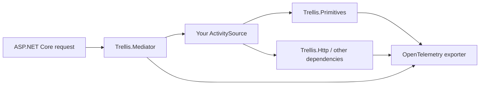

# Observability & Monitoring

**Level:** Intermediate 📘 | **Time:** 15-20 min | **Prerequisites:** [Basics](basics.md)

Observability matters most when something fails between layers: an HTTP call returns a conflict, a mediator command fails authorization, or a value object rejects input. Trellis exposes tracing hooks for exactly those boundaries.

## Installation

```bash
dotnet add package OpenTelemetry
dotnet add package OpenTelemetry.Extensions.Hosting
dotnet add package OpenTelemetry.Exporter.OpenTelemetryProtocol
```

## The short version

Trellis can emit spans from three useful places:

| Source | Activity source name | Best use |
| --- | --- | --- |
| Mediator pipeline | `Trellis.Mediator` | command/query tracing |
| Primitive value objects | `Trellis.Primitives` | validation and parsing boundaries |
| Result operations | `Trellis.Core` | deep ROP debugging |



## Start with the low-noise option

For most apps, the best first step is:

- add the mediator source
- add primitive value object instrumentation
- keep full result instrumentation off until you need deep debugging

```csharp
using Trellis;

var builder = WebApplication.CreateBuilder(args);

builder.Services.AddOpenTelemetry()
    .WithTracing(tracing => tracing
        .AddAspNetCoreInstrumentation()
        .AddHttpClientInstrumentation()
        .AddSource("Trellis.Mediator")
        .AddPrimitiveValueObjectInstrumentation()
        .AddOtlpExporter());
```

> [!TIP]
> `AddPrimitiveValueObjectInstrumentation()` is often the best default because it shows where input validation succeeds or fails without tracing every `Bind`, `Map`, and `Tap`.

## When to enable `AddResultsInstrumentation()`

`AddResultsInstrumentation()` traces Railway-Oriented Programming operations from `Trellis.Core`.

That is powerful, but noisy.

```csharp
using Trellis;

builder.Services.AddOpenTelemetry()
    .WithTracing(tracing => tracing
        .AddAspNetCoreInstrumentation()
        .AddHttpClientInstrumentation()
        .AddSource("Trellis.Mediator")
        .AddPrimitiveValueObjectInstrumentation()
        .AddResultsInstrumentation()
        .AddConsoleExporter());
```

Use it when you need to answer questions like:

- which `Bind` step failed?
- where did a result switch from success to failure?
- which branch in a long workflow produced the error?

> [!WARNING]
> `AddResultsInstrumentation()` is a debugging tool, not a default production recommendation. It can create a lot of spans.

## What mediator tracing gives you

If you use `AddTrellisBehaviors()`, `TracingBehavior` creates an activity for every mediator message.

On success:

- status → `Ok`

On failure:

- status → `Error`
- tag `error.type`
- tag `error.code`

That makes failed command/query execution easy to spot in any OpenTelemetry backend.

## Manual business instrumentation still matters

Framework spans tell you **where** something failed. Your own spans explain **what the business operation was doing**.

```csharp
using System.Diagnostics;
using System.Net.Http.Json;
using System.Text.Json.Serialization;
using Trellis;
using Trellis.Http;

[JsonSerializable(typeof(CreateOrderRequest))]
[JsonSerializable(typeof(OrderReceiptDto))]
internal partial class OrdersJsonContext : JsonSerializerContext
{
}

public sealed record CreateOrderRequest(string CustomerId, decimal Amount);
public sealed record OrderReceiptDto(string OrderId, decimal Amount);

public sealed class CheckoutClient(HttpClient httpClient)
{
    private static readonly ActivitySource ActivitySource = new("Acme.Checkout");

    public async Task<Result<OrderReceiptDto>> SubmitAsync(
        CreateOrderRequest request,
        CancellationToken cancellationToken)
    {
        using var activity = ActivitySource.StartActivity("Checkout.Submit");
        activity?.SetTag("order.customer_id", request.CustomerId);
        activity?.SetTag("order.amount", request.Amount);

        var result = await httpClient.PostAsJsonAsync(
                "orders",
                request,
                OrdersJsonContext.Default.CreateOrderRequest,
                cancellationToken)
            .HandleConflictAsync(new Error.Conflict(null, "conflict") { Detail = "An order with the same data already exists." })
            .ReadResultFromJsonAsync(OrdersJsonContext.Default.OrderReceiptDto, cancellationToken);

        if (result.IsFailure)
        {
            activity?.SetStatus(ActivityStatusCode.Error, result.Error.Detail);
            activity?.SetTag("error.code", result.Error.Code);
            activity?.SetTag("error.type", result.Error.GetType().Name);
        }
        else
        {
            activity?.SetStatus(ActivityStatusCode.Ok);
        }

        return result;
    }
}
```

## Why error codes matter in traces

Trellis errors carry machine-readable codes such as:

- `validation.error`
- `not.found.error`
- `forbidden.error`

Those codes are better than free-form log messages when you want dashboards, alerts, or grouped failure analysis.

## Suggested production setup

If you are sending data to a real collector, add sampling and keep the sources intentional.

```csharp
using OpenTelemetry.Trace;
using Trellis;

builder.Services.AddOpenTelemetry()
    .WithTracing(tracing => tracing
        .AddAspNetCoreInstrumentation()
        .AddHttpClientInstrumentation()
        .AddSource("Trellis.Mediator")
        .AddPrimitiveValueObjectInstrumentation()
        .SetSampler(new TraceIdRatioBasedSampler(0.1))
        .AddOtlpExporter());
```

## Practical guidance

### Prefer signal over volume

If every `Result` operation is traced, the interesting span can get buried. Start small.

### Use business spans for expensive workflows

Examples:

- checkout
- invoice generation
- approval workflows
- cross-service orchestration

### Use primitive traces to understand bad inputs

If you want to know why requests are failing validation at the edge, `Trellis.Primitives` is usually the clearest signal.

### Use result tracing only when needed

Turn on `AddResultsInstrumentation()` when debugging a complicated pipeline, then turn it back down.

## Next steps

- [Mediator Pipeline](integration-mediator.md)
- [HTTP Integration](integration-http.md)
- [Testing](integration-testing.md)
