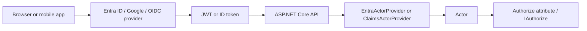

# Setting Up Single Sign-On (SSO)

**Level:** Intermediate | **Time:** 30-45 min | **Prerequisites:** [ASP.NET Core Authorization](integration-asp-authorization.md), [Testing with Entra ID Tokens](integration-entra-testing.md)

By the end of this guide, your API will authenticate users via SSO and map their identity to Trellis's `Actor` model.

This guide starts from the Trellis ASP template:

```bash
dotnet new trellis-asp
```

It is written for startup teams and indie developers who want a practical path to:

1. sign users in with a major identity provider
2. validate tokens in the API
3. translate claims into a Trellis `Actor`
4. protect endpoints with `[Authorize]` and Trellis authorization

## What You'll Build

You will wire an external identity provider into the Trellis ASP template so your API can:

1. accept a bearer token
2. validate that token
3. create an `Actor` from the authenticated user
4. authorize requests using Trellis permissions and attributes



Trellis authorization revolves around `Actor`, which contains:

- `Id`
- `Permissions`
- `ForbiddenPermissions`
- `Attributes`

Scoped permissions use `Actor.PermissionScopeSeparator`, which is `':'`. A scoped permission looks like `todos:read:tenant-123` only if **you** choose that naming scheme; Trellis itself only guarantees the separator character.

> [!TIP]
> Read [ASP.NET Core Authorization](integration-asp-authorization.md) first if you want the full mental model behind `Actor`, `IActorProvider`, and `IAuthorize`.

## Prerequisites

Before you start, make sure you have:

1. **.NET installed** and the Trellis template available:
   ```bash
   dotnet new trellis-asp
   ```
2. **A running template project**:
   ```bash
   dotnet run --project .\Api\src\Api.csproj
   ```
3. **An identity provider account**:
   - Microsoft Entra admin access for Part 1
   - Google Cloud Console access for Part 2
   - Okta/Auth0/Keycloak or another OIDC issuer for Part 3
4. **A frontend or API client** that can obtain tokens
   - browser SPA
   - Postman
   - curl plus a token copied from your frontend
5. **A clear local callback URL** for your frontend, such as:
   - `http://localhost:3000/auth/callback`
   - `http://localhost:5173/auth/callback`

> [!WARNING]
> The Trellis ASP template ships with `DevelopmentActorProvider` for Development only. It throws outside Development. Keep it for fast local testing, but do not expect real SSO to work until you run the app in a non-Development environment.

## Part 1: Microsoft Entra ID (Azure AD)

This is the simplest production path because Trellis already includes `AddEntraActorProvider()`, and `EntraActorProvider` understands common Entra claims out of the box.

### Step 1: Register Your App in Azure Portal

1. Open **Azure Portal**.
2. Go to **Microsoft Entra ID** -> **App registrations** -> **New registration**.
3. Name the app something like `TodoSample.Api`.
4. Choose the account type that matches your product:
   - **Single tenant** for internal company apps
   - **Multitenant** for SaaS apps used by many organizations
5. Click **Register**.
6. Copy these values:
   - **Directory (tenant) ID**
   - **Application (client) ID**
7. If you have a browser frontend, add its redirect URI under **Authentication**.
8. If you want Trellis permissions from Entra roles, create **App roles** such as:
   - `todos:read`
   - `todos:create`
   - `todos:update`
   - `todos:delete`
9. Assign those roles to users or groups through **Enterprise applications** -> your app -> **Users and groups**.

**Screenshot target:** You should be looking at **Entra ID -> App registrations -> Your app -> Overview**, then **Authentication**, then **App roles**.

> [!WARNING]
> If you forget the frontend redirect URI, sign-in succeeds at Entra but the browser never gets back to your app.

### Step 2: Configure `appsettings.json`

In `Api\src\appsettings.json`, add an `Authentication` section:

```json
{
  "Logging": {
    "LogLevel": {
      "Default": "Information",
      "Microsoft.AspNetCore": "Warning"
    }
  },
  "AllowedHosts": "*",
  "Authentication": {
    "Authority": "https://login.microsoftonline.com/<tenant-id>/v2.0",
    "Audience": "<api-client-id>"
  }
}
```

Replace:

1. `<tenant-id>` with the Entra tenant ID
2. `<api-client-id>` with the app registration client ID

For local secrets, user secrets are fine:

```bash
dotnet user-secrets --project .\Api\src\Api.csproj set "Authentication:Authority" "https://login.microsoftonline.com/<tenant-id>/v2.0"
dotnet user-secrets --project .\Api\src\Api.csproj set "Authentication:Audience" "<api-client-id>"
```

### Step 3: Wire Up Authentication in `Program.cs`

The Trellis ASP template already has authorization, but it does not enable real authentication yet. Make these two changes.

#### 3.1 Update `Api\src\Program.cs`

Change the `AddPresentation(...)` call so `DependencyInjection.cs` can read configuration:

```csharp
builder.Services
    .AddPresentation(builder.Configuration, builder.Environment)
    .AddApplication()
    .AddAntiCorruptionLayer(builder.Configuration.GetConnectionString("DefaultConnection") ?? "Data Source=todos.db");
```

Then add authentication middleware before authorization:

```csharp
app.UseHttpsRedirection();

if (!app.Environment.IsDevelopment())
    app.UseAuthentication();

app.UseAuthorization();
```

#### 3.2 Update `Api\src\DependencyInjection.cs`

Replace the current development/production actor-provider block with this:

```csharp
namespace TodoSample.Api;

using System.Collections.Generic;
using Asp.Versioning.Conventions;
using Microsoft.AspNetCore.Authentication.JwtBearer;
using Microsoft.AspNetCore.Authorization;
using Microsoft.Extensions.Configuration;
using Microsoft.Extensions.DependencyInjection;
using OpenTelemetry.Metrics;
using OpenTelemetry.Resources;
using OpenTelemetry.Trace;
using Scalar.AspNetCore;
using ServiceLevelIndicators;
using TodoSample.Api.Middleware;
using Trellis.Asp;
using Trellis.Asp.Authorization;

internal static class DependencyInjection
{
    public static IServiceCollection AddPresentation(
        this IServiceCollection services,
        IConfiguration configuration,
        IHostEnvironment environment)
    {
        services.ConfigureOpenTelemetry();
        services.ConfigureServiceLevelIndicators();
        services.AddProblemDetails();
        services.AddControllers().AddScalarValueValidation();
        services.AddApiVersioning()
                .AddMvc(options => options.Conventions.Add(new VersionByNamespaceConvention()))
                .AddApiExplorer()
                .AddOpenApi(options => options.Document.AddScalarTransformers());
        services.AddScoped<ErrorHandlingMiddleware>();
        services.AddHealthChecks();

        services.AddAuthorization(options =>
        {
            if (!environment.IsDevelopment())
            {
                options.FallbackPolicy = new AuthorizationPolicyBuilder()
                    .RequireAuthenticatedUser()
                    .Build();
            }
        });

        if (environment.IsDevelopment())
        {
            services.AddDevelopmentActorProvider(options =>
            {
                options.DefaultActorId = "development";
                options.DefaultPermissions = new HashSet<string>
                {
                    "todos:read",
                    "todos:create",
                    "todos:update"
                };
            });
        }
        else
        {
            var auth = configuration.GetSection("Authentication");

            services.AddAuthentication(JwtBearerDefaults.AuthenticationScheme)
                .AddJwtBearer(options =>
                {
                    options.Authority = auth["Authority"];
                    options.Audience = auth["Audience"];
                });

            services.AddEntraActorProvider();
        }

        return services;
    }

    private static IServiceCollection ConfigureOpenTelemetry(this IServiceCollection services)
    {
        static void configureResource(ResourceBuilder r) => r.AddService(
            serviceName: "TodoSampleService",
            serviceVersion: typeof(Program).Assembly.GetName().Version?.ToString() ?? "unknown");

        services.AddOpenTelemetry()
            .ConfigureResource(configureResource)
            .WithMetrics(builder =>
            {
                builder.AddAspNetCoreInstrumentation();
                builder.AddServiceLevelIndicatorInstrumentation();
                builder.AddMeter(
                    "Microsoft.AspNetCore.Hosting",
                    "Microsoft.AspNetCore.Server.Kestrel",
                    "System.Net.Http");
                builder.AddOtlpExporter();
            })
            .WithTracing(builder =>
            {
                builder.AddAspNetCoreInstrumentation();
                builder.AddPrimitiveValueObjectInstrumentation();
                builder.AddOtlpExporter();
            });

        return services;
    }

    private static IServiceCollection ConfigureServiceLevelIndicators(this IServiceCollection services)
    {
        services.AddServiceLevelIndicator(options =>
        {
            options.LocationId = ServiceLevelIndicator.CreateLocationId("public", "westus3");
        })
        .AddMvc()
        .AddApiVersion();

        return services;
    }
}
```

### Step 4: Map Entra Claims to Trellis `Actor`

The happy-path setup is simple because `EntraActorProvider` already maps the most useful claims.

| `Actor` field | Default Entra mapping |
| --- | --- |
| `Id` | `oid` / object identifier |
| `Permissions` | `roles` and `ClaimTypes.Role` |
| `ForbiddenPermissions` | empty set |
| `Attributes["tid"]` | tenant ID |
| `Attributes["preferred_username"]` | preferred username |
| `Attributes["azp"]` | authorized party |
| `Attributes["azpacr"]` | client auth method |
| `Attributes["acrs"]` | auth context class reference |
| `Attributes["ip_address"]` | current request IP |
| `Attributes["mfa"]` | derived from `amr == "mfa"` |

That means this works without extra mapping code:

```csharp
builder.Services.AddEntraActorProvider();
```

If you want to customize permissions later, do it in one place:

```csharp
builder.Services.AddEntraActorProvider(options =>
{
    options.MapPermissions = claims => claims
        .Where(c => string.Equals(c.Type, "roles", StringComparison.OrdinalIgnoreCase)
                 || string.Equals(c.Type, System.Security.Claims.ClaimTypes.Role, StringComparison.OrdinalIgnoreCase))
        .Select(c => c.Value)
        .ToHashSet(StringComparer.Ordinal);
});
```

> [!TIP]
> Use Entra app roles for coarse-grained permissions first. It is the quickest way to get Trellis permission checks working.

### Step 5: Protect Your Endpoints

Add a simple controller so you can see the mapped actor:

```csharp
using Microsoft.AspNetCore.Authorization;
using Microsoft.AspNetCore.Mvc;
using Trellis.Authorization;

namespace TodoSample.Api.Controllers;

[ApiController]
[Route("api/[controller]")]
public sealed class MeController(IActorProvider actorProvider) : ControllerBase
{
    [Authorize]
    [HttpGet]
    public async Task<IResult> Get(CancellationToken cancellationToken)
    {
        var actor = await actorProvider.GetCurrentActorAsync(cancellationToken);

        return Results.Ok(new
        {
            actor.Id,
            Permissions = actor.Permissions.OrderBy(p => p).ToArray(),
            TenantId = actor.GetAttribute(ActorAttributes.TenantId),
            Mfa = actor.GetAttribute(ActorAttributes.MfaAuthenticated)
        });
    }
}
```

Then use Trellis permissions in application code:

```csharp
if (!actor.HasPermission("todos:read"))
    return Result.Failure(Error.Forbidden("Missing todos:read permission."));
```

For tenant-scoped permissions, keep using `':'` as the separator:

```csharp
if (!actor.HasPermission("todos:read", tenantId))
    return Result.Failure(Error.Forbidden("Missing tenant-scoped permission."));
```

### Step 6: Test It

#### Fast local testing with `DevelopmentActorProvider`

1. Run the app normally:
   ```bash
   dotnet run --project .\Api\src\Api.csproj
   ```
2. Send an `X-Test-Actor` header:

```powershell
$actor = '{"Id":"local-user","Permissions":["todos:read","todos:create"],"ForbiddenPermissions":[],"Attributes":{"tid":"local-tenant","mfa":"false"}}'
Invoke-RestMethod https://localhost:5001/api/me -Headers @{ "X-Test-Actor" = $actor }
```

#### Real Entra token testing on your machine

Run the app in a non-Development environment so the Entra path executes:

```powershell
$env:ASPNETCORE_ENVIRONMENT = "Staging"
dotnet run --project .\Api\src\Api.csproj
```

Then call the API with a real bearer token:

```powershell
Invoke-RestMethod https://localhost:5001/api/me -Headers @{ Authorization = "Bearer <access-token>" }
```

If you want automated tests against real Entra tokens, use the patterns in [Testing with Entra ID Tokens](integration-entra-testing.md).

> [!WARNING]
> If the token validates but `actor.Permissions` is empty, the usual cause is that Entra app roles were created but never assigned to the user or group.

## Part 2: Google OAuth (OpenID Connect)

Google is usually the fastest consumer-facing option. The main difference from Entra is that Google gives you identity first, while your app usually decides permissions.

### Step 1: Create OAuth Credentials in Google Cloud Console

1. Open **Google Cloud Console**.
2. Go to **APIs & Services** -> **OAuth consent screen** and configure your app name.
3. Go to **Credentials** -> **Create Credentials** -> **OAuth client ID**.
4. Choose **Web application**.
5. Add your frontend origins and redirect URIs, for example:
   - `http://localhost:5173`
   - `http://localhost:5173/auth/callback`
6. Copy the **Client ID**.

**Screenshot target:** You should be looking at **Google Cloud Console -> APIs & Services -> Credentials** with an OAuth 2.0 client ID visible.

> [!WARNING]
> Google redirect URI matching is exact. A missing trailing path segment such as `/auth/callback` will break sign-in.

### Step 2: Configure `appsettings.json`

Use Google as the token issuer:

```json
{
  "Logging": {
    "LogLevel": {
      "Default": "Information",
      "Microsoft.AspNetCore": "Warning"
    }
  },
  "AllowedHosts": "*",
  "Authentication": {
    "Authority": "https://accounts.google.com",
    "Audience": "<google-client-id>",
    "ActorIdClaim": "sub",
    "PermissionsClaim": "permissions"
  }
}
```

### Step 3: Wire Up Google Authentication

For Google, use `ClaimsActorProvider`. It is the generic Trellis provider for JWT/OIDC claims.

Replace the non-development branch in `Api\src\DependencyInjection.cs` with this version:

```csharp
var auth = configuration.GetSection("Authentication");

services.AddAuthentication(JwtBearerDefaults.AuthenticationScheme)
    .AddJwtBearer(options =>
    {
        options.Authority = auth["Authority"];
        options.Audience = auth["Audience"];
        options.TokenValidationParameters.ValidIssuers =
        [
            "https://accounts.google.com",
            "accounts.google.com"
        ];
    });

services.AddClaimsActorProvider(options =>
{
    options.ActorIdClaim = auth["ActorIdClaim"] ?? "sub";
    options.PermissionsClaim = auth["PermissionsClaim"] ?? "permissions";
});
```

Use the same `Program.cs` changes from Part 1:

```csharp
builder.Services
    .AddPresentation(builder.Configuration, builder.Environment)
    .AddApplication()
    .AddAntiCorruptionLayer(builder.Configuration.GetConnectionString("DefaultConnection") ?? "Data Source=todos.db");
```

```csharp
app.UseHttpsRedirection();

if (!app.Environment.IsDevelopment())
    app.UseAuthentication();

app.UseAuthorization();
```

### Step 4: Map Google Claims to Trellis `Actor`

With this setup:

1. `Actor.Id` comes from Google `sub`
2. `Actor.Permissions` comes from whatever claim you choose as `PermissionsClaim`
3. if your Google token does not contain permission claims, `Actor.Permissions` is just empty

That is still a valid starting point. Many startup apps begin with:

1. `[Authorize]` for "signed-in users only"
2. application-level permissions loaded later from their own database

If you want to add app permissions during token validation, create flat `permissions` claims:

```csharp
services.AddAuthentication(JwtBearerDefaults.AuthenticationScheme)
    .AddJwtBearer(options =>
    {
        options.Authority = auth["Authority"];
        options.Audience = auth["Audience"];
        options.Events = new JwtBearerEvents
        {
            OnTokenValidated = context =>
            {
                if (context.Principal?.Identity is not System.Security.Claims.ClaimsIdentity identity)
                    return Task.CompletedTask;

                identity.AddClaim(new System.Security.Claims.Claim("permissions", "todos:read"));

                var email = identity.FindFirst("email")?.Value;
                if (!string.IsNullOrWhiteSpace(email) &&
                    email.EndsWith("@yourcompany.com", StringComparison.OrdinalIgnoreCase))
                {
                    identity.AddClaim(new System.Security.Claims.Claim("permissions", "todos:create"));
                }

                return Task.CompletedTask;
            }
        };
    });
```

> [!NOTE]
> `ClaimsActorProvider` only maps a flat actor ID claim and a flat permissions claim. If you also need `Actor.Attributes` or forbidden permissions from Google claims, create a custom `IActorProvider` and optionally wrap it with `AddCachingActorProvider<T>()`.

### Step 5: Test It

1. Keep local day-to-day development on `DevelopmentActorProvider`.
2. Run the app in `Staging` to exercise Google token validation:

```powershell
$env:ASPNETCORE_ENVIRONMENT = "Staging"
dotnet run --project .\Api\src\Api.csproj
```

3. Sign in through your frontend.
4. Send the returned token to your API:

```powershell
Invoke-RestMethod https://localhost:5001/api/me -Headers @{ Authorization = "Bearer <google-token>" }
```

If `/api/me` returns an `Id`, your SSO path is working.

## Part 3: Generic OIDC Provider

### The Pattern (works with Okta, Auth0, Keycloak, etc.)

The Trellis pattern for any OIDC provider is:

1. validate the token with ASP.NET Core authentication
2. map a stable user claim to `Actor.Id`
3. map a flat permissions or roles claim to `Actor.Permissions`
4. optionally switch to a custom provider if you need database-backed permissions or attributes

Use this `appsettings.json` shape:

```json
{
  "Authentication": {
    "Authority": "https://your-provider.example.com",
    "Audience": "your-api-audience",
    "ActorIdClaim": "sub",
    "PermissionsClaim": "permissions"
  }
}
```

Then use this registration:

```csharp
var auth = configuration.GetSection("Authentication");

services.AddAuthentication(JwtBearerDefaults.AuthenticationScheme)
    .AddJwtBearer(options =>
    {
        options.Authority = auth["Authority"];
        options.Audience = auth["Audience"];
    });

services.AddClaimsActorProvider(options =>
{
    options.ActorIdClaim = auth["ActorIdClaim"] ?? "sub";
    options.PermissionsClaim = auth["PermissionsClaim"] ?? "permissions";
});
```

Provider-specific tips:

1. **Okta** often uses `scp` or custom permissions claims.
2. **Auth0** often uses `permissions`.
3. **Keycloak** often uses `roles`, but nested role payloads may need normalization first.

If your provider emits permissions in a flat claim, you are done.

If your provider only proves identity and you load permissions from your own database, use a custom provider and cache it per request:

```csharp
services.AddCachingActorProvider<DatabaseActorProvider>();
```

That pattern is useful when:

1. the token contains `sub` but no app permissions
2. you need tenant-specific permissions from your own data store
3. you want custom `Actor.Attributes`

> [!WARNING]
> `ClaimsActorProvider` does not understand nested JSON claims like Keycloak `realm_access.roles`. Flatten them into regular claims during token validation or use a custom provider.

## Development vs Deployed Environments

Use `DevelopmentActorProvider` locally so you can iterate without a real identity provider. In every deployed environment (staging, production, etc.) use the **same SSO provider** — just point at different tenants or client IDs via configuration.

> [!WARNING]
> Do **not** use a different auth provider in staging than in production. Auth bugs are subtle — if staging uses Google and production uses Entra, you will miss token-format and claim-mapping issues until they hit real users.

### Environment-specific configuration

The only thing that changes between staging and production is the config values, not the provider type.

#### `Api\src\appsettings.Staging.json`

```json
{
  "Authentication": {
    "Authority": "https://login.microsoftonline.com/<staging-tenant-id>/v2.0",
    "Audience": "<staging-api-client-id>"
  }
}
```

#### `Api\src\appsettings.Production.json`

```json
{
  "Authentication": {
    "Authority": "https://login.microsoftonline.com/<prod-tenant-id>/v2.0",
    "Audience": "<prod-api-client-id>"
  }
}
```

### Registration pattern

```csharp
if (environment.IsDevelopment())
{
    services.AddDevelopmentActorProvider();
}
else
{
    var auth = configuration.GetSection("Authentication");
    services.AddAuthentication(JwtBearerDefaults.AuthenticationScheme)
        .AddJwtBearer(options =>
        {
            options.Authority = auth["Authority"];
            options.Audience = auth["Audience"];
        });

    services.AddEntraActorProvider(); // Same provider everywhere
}
```

> [!TIP]
> If you use separate Azure AD tenants for staging and production, create an app registration in each tenant with the same redirect URIs and permission scopes. This gives you full isolation while keeping the auth code path identical.

## Common Pitfalls

> [!WARNING]
> **Redirect URI mismatch** is the number-one setup error. The URI in your identity provider must exactly match your frontend callback URI.

> [!WARNING]
> **Audience mismatch** means the token was issued for the wrong app. Make sure `Authentication:Audience` matches the token's `aud` claim.

> [!WARNING]
> **CORS failures look like auth failures.** If your browser app runs on `http://localhost:5173` and your API runs somewhere else, configure CORS before blaming OIDC.

> [!WARNING]
> **DevelopmentActorProvider is Development-only.** If `ASPNETCORE_ENVIRONMENT` is not `Development`, Trellis will not allow the `X-Test-Actor` shortcut.

> [!WARNING]
> **Permissions are case-sensitive.** `todos:read` and `Todos.Read` are different strings. Pick one naming convention and stay consistent.

> [!WARNING]
> **Do not use `preferred_username` or email as your stable actor ID** when the provider gives you a better immutable identifier like `oid` or `sub`.

## Next Steps

Now that sign-in works:

1. read [ASP.NET Core Authorization](integration-asp-authorization.md) for deeper `Actor`, `IAuthorize`, and resource-authorization patterns
2. read [Testing with Entra ID Tokens](integration-entra-testing.md) if you want end-to-end token validation tests
3. move coarse permissions into provider roles first, then add database-backed permissions only when you actually need them
4. add tenant or business attributes to `Actor.Attributes` when your authorization rules go beyond simple role checks
