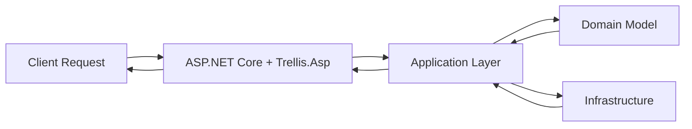

# Integration

When you adopt Trellis, the hard part is rarely `Result<T>` itself. The real work is making it feel natural in HTTP APIs, validation, persistence, authorization, and observability. These guides show the pieces that fit around Trellis in real applications.

> [!TIP]
> If you are building a web API, start with [ASP.NET Core Integration](integration-aspnet.md). It gives you the cleanest end-to-end path from domain results to HTTP responses.

## Pick the guide you need

| Guide | Use it when you need to... | What you will learn |
| --- | --- | --- |
| [ASP.NET Core Integration](integration-aspnet.md) | Turn `Result<T>` into clean HTTP responses | MVC, Minimal APIs, Problem Details, ETags, `Prefer`, pagination |
| [HTTP Client Integration](integration-http.md) | Consume HTTP APIs without exception-driven control flow | Functional status handling, deserialization into `Result<T>` and `Maybe<T>` |
| [FluentValidation Integration](integration-fluentvalidation.md) | Add richer validation rules at the application boundary | Validator composition, async validation, converting failures to Trellis results |
| [Entity Framework Core Integration](integration-ef.md) | Keep persistence explicit and result-driven | Repository patterns, database exception mapping, pagination |
| [Observability & Monitoring](integration-observability.md) | Trace and diagnose production behavior | OpenTelemetry, correlation, break-glass Result tracing |

## How the pieces fit together



In practice, most Trellis applications follow the same flow:

1. **Validate input early** with scalar-value validation and/or FluentValidation.
2. **Keep `Result<T>` inside your application layer** while business rules run.
3. **Map results once at the boundary** using ASP.NET Core or HttpClient integrations.
4. **Attach operational concerns** like authorization, concurrency, persistence, and telemetry around that core flow.

## A sensible learning path

### If you are building an HTTP API

1. Start with [ASP.NET Core Integration](integration-aspnet.md)
2. Add [FluentValidation Integration](integration-fluentvalidation.md) for business rules
3. Add [Entity Framework Core Integration](integration-ef.md) for persistence
4. Add [ASP.NET Core Authorization](integration-asp-authorization.md) if requests need actor-based authorization
5. Finish with [Observability & Monitoring](integration-observability.md)

### If you are calling other APIs

Start with [HTTP Client Integration](integration-http.md), then add the validation and observability guides as needed.

## What stays the same across all guides

No matter which integration you use, the same design rule keeps paying off:

> [!NOTE]
> Let Trellis types describe success and failure inside your application. Convert them to framework-specific responses only at the edge.

That usually means:

- `Result<T>` stays in handlers, services, and repositories
- ASP.NET Core controllers/endpoints call `ToActionResult(...)` or `ToHttpResult(...)`
- outbound HTTP code turns responses back into `Result<T>`
- validation, authorization, and persistence all return explicit failures instead of throwing for expected conditions

## Quick start

If you want the shortest path to something useful:

```csharp
using Trellis.Asp;

var builder = WebApplication.CreateBuilder(args);

builder.Services.AddControllers();
builder.Services.AddTrellisAsp();

var app = builder.Build();
app.MapControllers();
app.Run();
```

From there:

- add `AddScalarValueValidation()` when you use scalar value objects in requests
- add `integration-asp-authorization.md` when HTTP claims need to become an `Actor`
- add EF Core and FluentValidation integrations as your app grows

## Next step

Go to [ASP.NET Core Integration](integration-aspnet.md).
