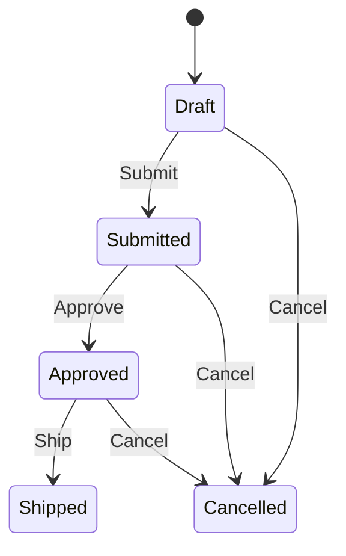

# State Machines

State machines matter when the order of operations is part of the business rule.

If an order must go `Draft -> Submitted -> Approved -> Shipped`, you do not want that logic scattered across `if` statements and exception handling. You want one explicit model of the workflow.

Trellis integrates with [Stateless](https://github.com/dotnet-state-machine/stateless) so invalid transitions can participate in result-based flows instead of blowing up ordinary pipelines.

## Why use Trellis here?

Plain Stateless throws `InvalidOperationException` when a trigger is not valid in the current state.

That is fine for exception-based code, but awkward in a result-based application flow.

```csharp
using System;
using Stateless;

public enum OrderState { Draft, Submitted, Approved, Shipped, Cancelled }
public enum OrderTrigger { Submit, Approve, Ship, Cancel }

var machine = new StateMachine<OrderState, OrderTrigger>(OrderState.Draft);
machine.Configure(OrderState.Draft)
    .Permit(OrderTrigger.Submit, OrderState.Submitted);

try
{
    machine.Fire(OrderTrigger.Ship);
}
catch (InvalidOperationException ex)
{
    Console.WriteLine(ex.Message);
}
```

With Trellis, the same invalid transition can stay inside the railway:

```csharp
using Stateless;
using Trellis;
using Trellis.StateMachine;

public enum OrderState { Draft, Submitted, Approved, Shipped, Cancelled }
public enum OrderTrigger { Submit, Approve, Ship, Cancel }

var machine = new StateMachine<OrderState, OrderTrigger>(OrderState.Draft);
machine.Configure(OrderState.Draft)
    .Permit(OrderTrigger.Submit, OrderState.Submitted);

Result<OrderState> result = machine.FireResult(OrderTrigger.Ship);
```

## Installation

```bash
dotnet add package Trellis.StateMachine
```

## A simple working example

```csharp
using Stateless;
using Trellis;
using Trellis.StateMachine;

public enum OrderState { Draft, Submitted, Approved, Shipped, Cancelled }
public enum OrderTrigger { Submit, Approve, Ship, Cancel }

var state = OrderState.Draft;
var machine = new StateMachine<OrderState, OrderTrigger>(() => state, s => state = s);

machine.Configure(OrderState.Draft)
    .Permit(OrderTrigger.Submit, OrderState.Submitted)
    .Permit(OrderTrigger.Cancel, OrderState.Cancelled);

machine.Configure(OrderState.Submitted)
    .Permit(OrderTrigger.Approve, OrderState.Approved)
    .Permit(OrderTrigger.Cancel, OrderState.Cancelled);

machine.Configure(OrderState.Approved)
    .Permit(OrderTrigger.Ship, OrderState.Shipped)
    .Permit(OrderTrigger.Cancel, OrderState.Cancelled);

Result<OrderState> submit = machine.FireResult(OrderTrigger.Submit);
Result<OrderState> approve = machine.FireResult(OrderTrigger.Approve);
Result<OrderState> invalidCancel = machine.FireResult(OrderTrigger.Cancel);
```

## Visualizing the workflow



## What `FireResult` actually guarantees

`FireResult` is intentionally narrow and predictable.

### On success

- it pre-checks the trigger with `CanFire(trigger)` (which honors `PermitIf`/`IgnoreIf` guards)
- it fires the trigger once
- it returns `Result<TState>` containing the new state

### On failure

- if `CanFire(trigger)` returns false, it returns `Error.UnprocessableContent` (HTTP 422) carrying a single `RuleViolation` with reason code `state.machine.invalid.transition` and a Trellis-owned `Detail` string — no Stateless exception is involved. Invalid transitions are semantic rule violations, not concurrent-modification conflicts.
- the failure shape is therefore independent of the Stateless library version and its exception message text

### What it does **not** do

- it does **not** make Stateless thread-safe — Stateless is single-threaded by contract; callers must externally synchronize concurrent calls
- it does **not** swallow arbitrary exceptions from your own entry, exit, guard, accessor, mutator, or configuration code — those propagate to the caller
- it does **not** depend on the textual content of any Stateless exception, so library upgrades that reword internal messages will not break it

> [!NOTE]
> Because `FireResult` evaluates the guard once via `CanFire` and again via `Fire`, transition guards must be **idempotent and side-effect-free** — which is already a Stateless requirement. The guard is evaluated at most twice per `FireResult` call.

> [!WARNING]
> `FireResult<TState, TTrigger>` has `where TState : notnull` and `where TTrigger : notnull` constraints. `LazyStateMachine<TState, TTrigger>` has the same constraints.

## Composing transitions with Trellis pipelines

The main benefit is not just avoiding exceptions. It is that state changes now compose naturally with other result-based work.

```csharp
using Stateless;
using Trellis;
using Trellis.StateMachine;

public sealed class OrderWorkflow
{
    private OrderState _state = OrderState.Draft;
    private readonly StateMachine<OrderState, OrderTrigger> _machine;

    public List<string> Events { get; } = [];

    public OrderWorkflow()
    {
        _machine = new StateMachine<OrderState, OrderTrigger>(() => _state, s => _state = s);

        _machine.Configure(OrderState.Draft)
            .Permit(OrderTrigger.Submit, OrderState.Submitted);

        _machine.Configure(OrderState.Submitted)
            .Permit(OrderTrigger.Approve, OrderState.Approved);
    }

    public Result<OrderWorkflow> Submit() =>
        _machine.FireResult(OrderTrigger.Submit)
            .Tap(_ => Events.Add("OrderSubmitted"))
            .Map(_ => this);
}
```

That is the Trellis-friendly pattern:

1. transition with `FireResult(...)`
2. do side effects with `Tap(...)`
3. return the richer domain object with `Map(_ => this)` when needed

## `LazyStateMachine<TState, TTrigger>`: for ORM materialization scenarios

A common problem with ORMs is timing.

The object is constructed first, and only then are its properties populated. If your state machine reads the state too early, it can start from the wrong value.

`LazyStateMachine<TState, TTrigger>` solves that by deferring machine creation until first use.

```csharp
using Stateless;
using Trellis;
using Trellis.StateMachine;

public enum DocumentState { Draft, Published }
public enum DocumentTrigger { Publish }

public sealed class DocumentWorkflow
{
    private readonly LazyStateMachine<DocumentState, DocumentTrigger> _machine;

    public DocumentState State { get; private set; } = DocumentState.Draft;

    public DocumentWorkflow()
    {
        _machine = new LazyStateMachine<DocumentState, DocumentTrigger>(
            () => State,
            state => State = state,
            machine => machine.Configure(DocumentState.Draft)
                .Permit(DocumentTrigger.Publish, DocumentState.Published));
    }

    public Result<DocumentState> Publish() =>
        _machine.FireResult(DocumentTrigger.Publish);
}
```

## Important `LazyStateMachine` facts

- it is **sealed**
- it is **not thread-safe**
- initialization uses lazy creation with no locking
- configuration runs once, on first use
- the underlying machine is available through `.Machine` when you need direct Stateless access

> [!WARNING]
> Do not share one `LazyStateMachine` instance across concurrent callers without external synchronization.

## When to use a state machine at all

Use one when the workflow is part of the domain, not just UI flow.

Good candidates:

- orders
- approvals
- fulfillment
- publishing
- onboarding workflows
- long-running business processes with explicit transitions

Probably overkill:

- one-off CRUD entities with no meaningful lifecycle
- state that is purely cosmetic or presentation-specific

## Bottom line

Use state machines when the workflow itself is business logic.

Use `FireResult(...)` when you want that workflow to stay inside Trellis pipelines.

Use `LazyStateMachine<TState, TTrigger>` when object materialization timing would otherwise make machine setup fragile.
